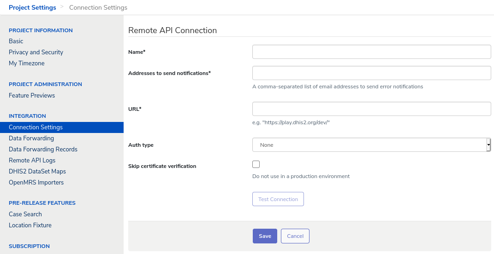
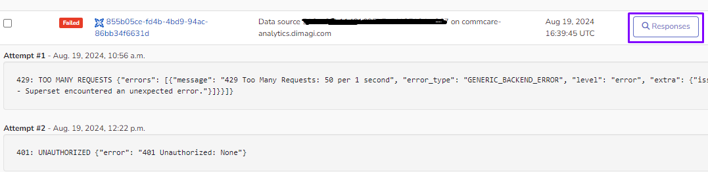

Enabling Data Integration (Form and Case Forwarding)
====================================================

This feature requires a CommCare Software Plan

This feature is only available to CommCare users with a Pro Plan or above. For more details, please see the `CommCare Pricing Overview <https://dimagi.atlassian.net/wiki/spaces/commcarepublic/pages/2420015134/CommCare+Pricing+Overview>`_.

Setting up a remote API connection
------------------------------------

CommCare HQ manages remote API services and credentials under Project Settings > Connection Settings.

- Give your connection a name.
- Provide one or more addresses to send notifications to if something unexpected happens when forwarding data.
- Specify the URL to which CommCare will be sending data.
- And then select how CommCare must authenticate with the remote API, and provide credentials as required.

Setting up Data Forwarding
--------------------------

You can configure your project to forward any incoming forms and/or cases to a specified URL. To do so, in CommCare HQ navigate to Project Settings and then to Data Forwarding. It will look something like this:

.. image:: ../images/set_up_data_forwarding.png

There are no current limitations on the number of repeaters you can add to your project, but if you set up a repeater and notice a delay in record forwarding times, please contact our support team.

Payloads
--------

When a payload is created a repeat record is registered. A repeat record represents a place in the repeat record queue, and points to the payload. On registration, its status is set to "pending" and HQ tries to send the payload immediately. If sending succeeds, its status is changed to "succeeded" and the process is complete.

If sending fails, its status is changed to "failed" and it will be retried. There are multiple retries, and each time the interval between tries is increased. This improves the chances of a successful send, because it gives the endpoint more time to recover.

Whether a record is queued for its first or fourth attempt, it enters the same queue. Consequently, any delays in this queue impact all records, regardless of their status.

If the record is still not successfully sent after multiple retries, its state is changed to "cancelled."

You can follow the status of the payload by clicking on Responses.

What does your server expect
----------------------------

Data will be forwarded, and the contents of what is forwarded will be in the body of the HTTP POST. This does not use HTML form-style parameters.

In the examples below, we'll show you what HTTP Headers and POST body to expect. All newlines and indentation is for clarity only below; in the actual post any newline + indentation will be a single space.

Forward Form
~~~~~~~~~~~~

You get the complete form (one POST per form)

In addition to the form there will be an extra header 'received-on' that is the time the form was received by CommCare HQ.

**Example HTTP Request to your server**

- **QUERYSTRING**

   app_id: db9f874f0219444ee7848ddd023e292e

- **HEADERS**

   - Accept-Encoding: identity
   - Host: requestb.in
   - Total-Route-Time: 0
   - Content-Type: text/xml
   - X-Request-Id: 42863ab1-1dfb-49cb-b0ed-33f924f6cd3b
   - Received-On: 2015-04-17T20:14:34.046462Z
   - Connection: close
   - Content-Length: 1135
   - Via: 1.1 vegur
   - Connect-Time: 5

- **RAW BODY**

.. code-block:: xml

   <?xml version='1.0' ?>
   <data uiVersion="1"
       version="10"
       name="Untitled Form"
       xmlns:jrm="http://dev.commcarehq.org/jr/xforms"
       xmlns="http://openrosa.org/formdesigner/B9C4EB51-A7CC-49B5-B7D5-10E9F10B450B">
     <question1>Trees</question1>
     <n0:case case_id="b0916685-7247-4c44-b712-633d3d64e0c0"
         date_modified="2015-04-17T16:04:54.950-04"
         user_id="d0e472a6b36dfd3ee5059222e12b8c1b"
         xmlns:n0="http://commcarehq.org/case/transaction/v2"><n0:create>
       <n0:case_name>Trees</n0:case_name>
       <n0:owner_id>d0e472a6b36dfd3ee5059222e12b8c1b</n0:owner_id>
       <n0:case_type>mscase</n0:case_type>
       </n0:create>
     </n0:case>
     <n1:meta xmlns:n1="http://openrosa.org/jr/xforms">
       <n1:deviceID>990005013558458</n1:deviceID>
       <n1:timeStart>2015-04-17T16:04:42.383-04</n1:timeStart>
       <n1:timeEnd>2015-04-17T16:04:54.950-04</n1:timeEnd>
       <n1:username>danny</n1:username>
       <n1:userID>d0e472a6b36dfd3ee5059222e12b8c1b</n1:userID>
       <n1:instanceID>afcb3026-c4b3-463f-85ec-0cb9a2737fc5</n1:instanceID>
       <n2:appVersion xmlns:n2="http://commcarehq.org/xforms">CommCare ODK, version "2.19.8"(350848). App v10. CommCare Version 2.19. Build 1000, built on: January-22-2015</n2:appVersion>
     </n1:meta>
   </data>

Forward Cases
~~~~~~~~~~~~~

You get a case block representing the latest state of any cases affected by the form (one POST per case).

When you turn on case forwarding, every time a case changes on HQ, it will forward the case in its entirety to your URL (not just the last change). We expect that you will receive the case, look to see if there's a case with the same id already in your system, and then either create or update the case with all the information given. If the case has been closed, we will send the case with just a close block.

The URL you set up to deal with the in-coming information can expect to receive one case block at a time, in the format specified below (XML or JSON).

In addition to the case there will be an extra header 'server-modified-on' that is the last time the case was modified in CommCare HQ.

**Example HTTP Request to your server**

- **HEADERS**

   - Server-Modified-On: 2015-04-17T20:14:34.139959Z
   - Host: requestb.in
   - Accept-Encoding: identity
   - Via: 1.1 vegur
   - X-Request-Id: 30926e2a-397a-45e4-83f2-a792c5775c7e
   - Total-Route-Time: 1
   - Content-Length: 324
   - Connection: close
   - Connect-Time: 2
   - Content-Type: text/xml

- **RAW BODY (XML)**

.. code-block:: xml

   <case case_id="b0916685-7247-4c44-b712-633d3d64e0c0"
       date_modified="2015-04-17T16:04:54.950000Z"
       user_id="d0e472a6b36dfd3ee5059222e12b8c1b"
       xmlns="http://commcarehq.org/case/transaction/v2">
     <create>
       <case_type>mscase</case_type>
       <case_name>Trees</case_name>
       <owner_id>d0e472a6b36dfd3ee5059222e12b8c1b</owner_id>
     </create>
   </case>

- **RAW BODY (JSON)**

.. code-block:: json

   { "case_id" : "b0916685-7247-4c44-b712-633d3d64e0c0",
       "closed" : false,
       "date_closed" : null,
       "date_modified" : "2015-04-17T16:04:54.950000Z",
       "domain" : "demo",
       "indices" : {  },
       "properties" : {
           "case_name" : "Trees",
           "case_type" : "mscase",
           "date_opened" : "2012-03-13T18:21:52Z",
           "owner_id" : "d0e472a6b36dfd3ee5059222e12b8c1b",
         },
       "server_date_modified" : "2012-04-05T23:56:41Z",
       "server_date_opened" : "2012-04-05T23:56:41Z",
       "user_id" : "d0e472a6b36dfd3ee5059222e12b8c1b",
       "version" : "2.0",
       "xform_ids" : [ "3HQEXR2S0GIRFY2GF40HAR7ZE" ]
     }

Forward Form Stub
~~~~~~~~~~~~~~~~~

You get a timestamp (GMT), the form's id, and the ids of any affected cases

This works especially well in conjunction with our Data APIs; you can get notified of a change using Form Stub Forwarding and then use the Data APIs to look up the form and cases affected, either right away or at a later date.

**Example HTTP Request to your server**

- **HEADERS**

   - Host: requestb.in
   - Accept-Encoding: identity
   - Via: 1.1 vegur
   - Received-On: 2015-04-17T20:14:34.046462Z
   - X-Request-Id: 244433bd-85d8-4444-8cea-a56fcc30d6b2
   - Total-Route-Time: 0
   - Content-Length: 151
   - Connection: close
   - Connect-Time: 2
   - Content-Type: text/xml

- **RAW BODY**

.. code-block:: json

   {
     "received_on": "2015-04-17T20:14:34.046462Z",
     "form_id": "afcb3026-c4b3-463f-85ec-0cb9a2737fc5",
     "case_ids": ["b0916685-7247-4c44-b712-633d3d64e0c0"]
   }

Forward App Schema Changes
~~~~~~~~~~~~~~~~~~~~~~~~~~

**Description**

You get notified of the app id whenever an app change is saved and the "build id" whenever a new version is built.

**Example HTTP Request to your server**

- **HEADERS**

   - Host: requestb.in
   - Accept-Encoding: identity
   - Via: 1.1 vegur
   - X-Request-Id: 9f211dd8-19d0-49be-980d-3c7f879336a5
   - Total-Route-Time: 0
   - Content-Length: 32
   - Connection: close
   - Connect-Time: 0
   - Content-Type: text/xml

- **RAW BODY**

.. code-block:: text

   193b28e58f335f165cb3e2bbe02b3ed8

Error notifications
-------------------

CommCare will send error notifications to the email addresses specified for the remote API connection under Connection Settings. This will happen for errors raised by the remote API, like server errors, authentication errors, response timeouts, or network connection failures.

The notification will show the error message as given by the remote API, and will include the name of the project space, the URL that the request was sent to, and, if applicable, the ID of the form or case that was sent, so that the recipient has the information they need to follow up.

The email will also include instructions on how to stop getting notification in the future. All remote API connections should have at least one email address for notifications so that if data forwarding stops working for any reason, someone is aware of that.
