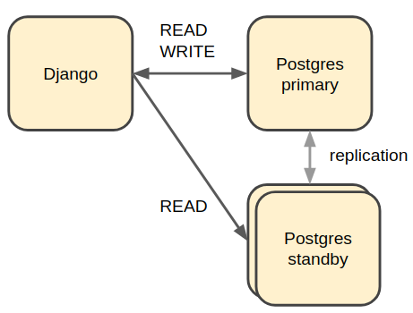
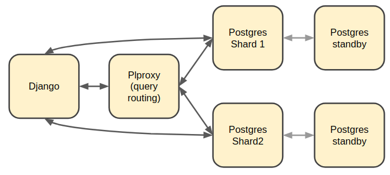

Configuring SQL Databases in CommCare
=====================================

CommCare makes use of a number of logically different SQL databases. These databases
can be all be a single physical database or configured as individual databases.

By default CommCare will use the `default` Django database for all SQL data.

Synclog Data
~~~~~~~~~~~
Synclog data may be stored in a separate database specified by the
`SYNCLOGS_SQL_DB_ALIAS` setting. The value of this setting must be a DB
alias in the Django `DATABASES` setting.

UCR Data
~~~~~~~~
Data created by the UCR framework can be stored in multiple separate databases.
Each UCR defines an `engine_id` parameter which tells it which configured
database engine to use. These *engines* are defined in the `REPORTING_DATABASES`
Django setting which maps the `engine_id` to a Django database alias defined
in the `DATABASES` setting.

.. code-block:: python

    REPORTING_DATABASES = {
        'default': 'default',
        'ucr': 'ucr'
    }

Sharded Form and Case data
~~~~~~~~~~~~~~~~~~~~~~~~~~
It is recommended to have a separate set of databases to store data for Forms
and Cases (as well as a few other models).

CommCare uses a combination of plproxy_ custom Python code to split the Form and Case
data into multiple databases.

.. _plproxy: https://plproxy.github.io/

The general rule is that if a query needs to be run on all (or most) shard databases
it should go through plproxy since plproxy is more efficient at running multiple
queries and compiling the results.

The configuration for these databases must be added to the `DATABASES` setting
as follows:

.. code-block:: python

    USE_PARTITIONED_DATABASE = True

    PARTITION_DATABASE_CONFIG = {
        'shards': {
            'p1': [0, 511],  # shard range for p1 database
            'p2': [512, 1023],
        },
        'proxy': 'proxydb'
    }

The keys in `PARTITION_DATABASE_CONFIG['shards']` as well as the value of `PARTITION_DATABASE_CONFIG['proxy']
 must be databases defined in the `DATABASES` setting.

Rules for shards
................

* There can only be one proxy DB
* The total number of shards must be a power of 2 i.e. 2, 4, 8, 16, 32 etc
* The number of shards cannot be changed once you have data in them so
  it is wise to start with a large enough number e.g. 1024
* The shard ranges must start at 0
* The shard ranges are inclusive

  - [0, 3] -> [0, 1, 2, 3]

* The shard ranges must be continuous (no gaps)

Sending read queries to standby databases
=========================================

By including details for standby databases in the Django `DATABASES` setting we can configure
CommCare to route certain READ queries to them.

Standby databases are configured in the same way as normal databases but may have an additional
property, `HQ_ACCEPTABLE_STANDBY_DELAY`. The value of this must be an integer and configures the
acceptable replication delay in seconds between the standby and the primary. If the replication delay goes
above this value then queries will not be routed to this database.

The default value for `HQ_ACCEPTABLE_STANDBY_DELAY` is 3 seconds.

.. code-block:: python

    DATABASES = {
        'standby1': {
            ...
            'HQ_ACCEPTABLE_STANDBY_DELAY': N
        }
    }

Once the standby databases are configured in the `DATABASES` settings there are two additional settings
that control which queries get routed to them.

**REPORTING_DATABASES**

The `REPORTING_DATABASES` setting can be updated as follows:

.. code-block:: python

    REPORTING_DATABASES = {
        'default': 'default',
        'ucr': {
            'WRITE': 'ucr',
            'READ': [
                ('ucr', 1),
                ('ucr_standby1', 2),
                ('ucr_standby2', 2),
            ]
        }
    }

The tuples listed under the 'READ' key specify a database alias (must be in `DATABASES`) and
weighting. In the configuration above 20% of reads will be sent to `ucr` and 40% each
to `ucr_standby1` and `ucr_standby2` (assuming both of them are available and have replication
delay within range).

**LOAD_BALANCED_APPS**

This setting is used to route read queries from Django models.

.. code-block:: python

    LOAD_BALANCED_APPS = {
        'users': {
            'WRITE': 'default',
            'READ': [
                ('default', 1),
                ('standby1', 4),
            ]
        }
    }

In the configuration above all write queries from models in the `users` app will go to the
`default` database as well as 20% or read queries. The remaining 80% of read queries will
be sent to the `standby1` database.
