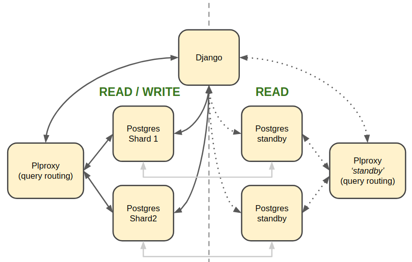

.. _commcare_postgresql_configuration:

Configuring SQL Databases in CommCare
=====================================

CommCare makes use of a number of logically different SQL databases. These databases
can be all be a single physical database or configured as individual databases.

By default CommCare will use the `default` Django database for all SQL data.

.. image:: images/django_db_monolith.png

Synclog Data
~~~~~~~~~~~~
Synclog data may be stored in a separate database specified by the
`SYNCLOGS_SQL_DB_ALIAS` setting. The value of this setting must be a DB
alias in the Django `DATABASES` setting.

UCR Data
~~~~~~~~
Data created by the `UCR framework  <ucr.html>`_ can be stored in multiple separate databases.
Each UCR defines an `engine_id` parameter which tells it which configured
database engine to use. These *engines* are defined in the `REPORTING_DATABASES`
Django setting which maps the `engine_id` to a Django database alias defined
in the `DATABASES` setting.

.. code-block:: python

    REPORTING_DATABASES = {
        'default': 'default',
        'ucr': 'ucr'
    }

Sharded Form and Case data
~~~~~~~~~~~~~~~~~~~~~~~~~~
It is recommended to have a separate set of databases to store data for Forms
and Cases (as well as a few other models).

CommCare uses a combination of plproxy_ custom Python code to split the Form and Case
data into multiple databases.

.. _plproxy: https://plproxy.github.io/

.. image:: images/django_db_sharded.png

The general rule is that if a query needs to be run on all (or most) shard databases
it should go through plproxy since plproxy is more efficient at running multiple
queries and compiling the results.

The configuration for these databases must be added to the `DATABASES` setting
as follows:

.. code-block:: python

    USE_PARTITIONED_DATABASE = True

    DATABASES = {
        'proxy': {
            ...
            'PLPROXY': {
                'PROXY': True
            }
        },
        'p1': {
            ...
            'PLPROXY': {
                'SHARDS': [0, 511]
            }
        },
        'p2': {
            ...
            'PLPROXY': {
                'SHARDS': [512, 1023]
            }
        }
    }

Rules for shards
................

* There can only DB with `PROXY=True`
* The total number of shards must be a power of 2 i.e. 2, 4, 8, 16, 32 etc
* The number of shards cannot be changed once you have data in them so
  it is wise to start with a large enough number e.g. 1024
* The shard ranges must start at 0
* The shard ranges are inclusive

  - [0, 3] -> [0, 1, 2, 3]

* The shard ranges must be continuous (no gaps)

Sending read queries to standby databases
~~~~~~~~~~~~~~~~~~~~~~~~~~~~~~~~~~~~~~~~~

By including details for standby databases in the Django `DATABASES` setting we can configure
CommCare to route certain READ queries to them.

Standby databases are configured in the same way as normal databases but may have an additional
property group, `STANDBY`. This property group has the following sup-properties:

MASTER
    The DB alias of the master database for this standby. This must refer to a database in the `DATABASES`
    setting.

ACCEPTABLE_REPLICATION_DELAY
    The value of this must be an integer and configures the acceptable replication delay in seconds
    between the standby and the master. If the replication delay goes above this value then queries
    will not be routed to this database.

    The default value for `ACCEPTABLE_REPLICATION_DELAY` is 3 seconds.

.. code-block:: python

    DATABASES = {
        'default': {...}
        'standby1': {
            ...
            'STANDBY': {
                'MASTER': 'default',
                'ACCEPTABLE_REPLICATION_DELAY': 30,
            }
        }
    }

Once the standby databases are configured in the `DATABASES` settings there are two additional settings
that control which queries get routed to them.

**REPORTING_DATABASES**

The `REPORTING_DATABASES` setting can be updated as follows:

.. code-block:: python

    REPORTING_DATABASES = {
        'default': 'default',
        'ucr': {
            'WRITE': 'ucr',
            'READ': [
                ('ucr', 1),
                ('ucr_standby1', 2),
                ('ucr_standby2', 2),
            ]
        }
    }

The tuples listed under the 'READ' key specify a database alias (must be in `DATABASES`) and
weighting. In the configuration above 20% of reads will be sent to `ucr` and 40% each
to `ucr_standby1` and `ucr_standby2` (assuming both of them are available and have replication
delay within range).

**LOAD_BALANCED_APPS**

This setting is used to route read queries from Django models.

.. code-block:: python

    LOAD_BALANCED_APPS = {
        'users': {
            'WRITE': 'default',
            'READ': [
                ('default', 1),
                ('standby1', 4),
            ]
        }
    }

In the configuration above all write queries from models in the `users` app will go to the
`default` database as well as 20% or read queries. The remaining 80% of read queries will
be sent to the `standby1` database.

For both the settings above, the following rules apply to the databases listed
under `READ`:

* There can only be one master database (not a standby database)
* All standby databases must point to the same master database
* If a master database is in this list, all standbys must point to this master

Using standbys with the plproxy cluster
.......................................
The plproxy cluster needs some special attention since the queries are routed by plproxy and not by
Django. In order to do this routing there are a number of additional pieces that are needed:

1. Separate plproxy cluster configuration which points the shards to the appropriate standby node instead
of the primary node.
2. Duplicate SQL functions that make use of this new plproxy cluster.

In order to maintain the SQL function naming the new plproxy cluster must be in a separate database.

**Example usage**

.. code-block:: python

    # this will connect to the shard standby node directly
    case = CommCareCaseSQL.objects.partitioned_get(case_id)

    # this will call the `get_cases_by_id` function on the 'standby' proxy which in turn
    # will query the shard standby nodes
    cases = CaseAccessor(domain).get_cases(case_ids)

These examples assume the standby routing is active as described in the `Routing queries to standbys`_
section below.

**Steps to setup**

1. Add all the standby shard databases to the Django `DATABASES` setting as described above.

2. Create a new database for the standby plproxy cluster configuration and SQL accessor functions
and add it to `DATABASES` as shown below:

.. code-block:: python

    DATABASES = {
        'proxy_standby': {
            ...
            'PLPROXY': {
                'PROXY_FOR_STANDBYS': True
            }
        }
    }

3. Run the `configure_pl_proxy_cluster` management command to create the config on the 'standby' database.
4. Run the Django migrations to create the tables and SQL functions in the new standby proxy database.

Routing queries to standbys
---------------------------
The configuration above makes it possible to use the standby databases however in order to actually
route queries to them the DB router must be told to do so. This can be done it one of two ways:

1. Via an environment variable

.. code-block::

    export READ_FROM_PLPROXY_STANDBYS=1

This will route ALL read queries to the shard standbys. This is mostly useful when running a process like
pillowtop that does is asynchronous.

2. Via a Django decorator / context manager

.. code-block:: python

    # context manager
    with read_from_plproxy_standbys():
        case = CommCareCaseSQL.objects.partitioned_get(case_id)

    # decorator
    @read_from_plproxy_standbys()
    def get_case_from_standby(case_id)
        return CommCareCaseSQL.objects.partitioned_get(case_id)
