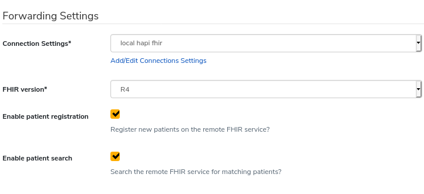

Forwarding Cases to a FHIR API
==============================

Overview
--------

CommCare can forward case data to a FHIR API. Patient data can be
treated differently from other data, in order to follow a workflow to
avoid duplicating patient records.

This documentation follows the process to set up this kind of
integration.

The "FHIR Integration" feature flag will need to be enabled.

Data design
-----------

The first step is to determine what data to send.

A spreadsheet offers a good medium for documenting the FHIR
resource types that are required, and their properties.

You will want columns for the CommCare case property name, the path to
the corresponding value in the FHIR resource (values can be nested, e.g.
"Encounter.subject.reference), and, if they aren't both strings/text,
the data types of the CommCare and FHIR values.

It is useful to build the spreadsheet alongside the
`HL7 FHIR reference documentation <fhir-ref>`_ so that it is easy to
look up FHIR resource property data types and value sets where
applicable.

This process will result in a good understanding of what the CommCare
app needs to include, question types to use, and the values for multiple
choice questions.

It can also be helpful to have an example of the FHIR resource you need
to create. In addition to the case property values you need, this will
also show you other values, like the code system that a code belongs to.
e.g. ::

    {
      /* case property values: */
      "code": "91300",
      "display": "Pfizer-BioNTech COVID-19 Vaccine",

      /* other values: */
      "system": "http://www.ama-assn.org/go/cpt",
      "version": "2021"
    }

App building
------------

The second step is to build the CommCare app for collecting the data to
be sent.

Searching for patients by name
~~~~~~~~~~~~~~~~~~~~~~~~~~~~~~

CommCare's Data Forwarding to FHIR can be configured to register
Patients as their cases are registered in CommCare, and to search for
patients, so as to avoid duplication.

You can find these options when setting up data forwarding: Go to
"Project Settings" > "Data Forwarding", under "Forward Cases to a FHIR
API", click "+ Add a service to forward to".

Check "Enable patient registration" to register patients. If this is not
checked then patients registered in CommCare will not be created on the
remote FHIR service.

Check "Enable patient search" checkbox to search the FHIR service for an
existing patient that matches the CommCare patient. If this is not
checked and patient registration is enabled, then CommCare will always
create a new patient a patient is registered in CommCare.

If searching for patients is enabled, CommCare has some additional
requirements of an app, regarding patients' names.

Patient search uses three patient name properties:

* ``Patient.name[0].given``
* ``Patient.name[0].family``
* ``Patient.name[0].text``

It is worth stressing that CommCare only uses the first "name" instance
of the Patient resource. If the resource has multiple values for name,
patient search ignores the later values.

Patients are searched for using ``Patient.name[0].text`` and their
CommCare case ID first. A good approach is for the patient registration
form to join their given name with their family name to determine their
full name, and map that to ``Patient.name[0].text``. (It also makes a
good case name.)

Patients are also searched for using "given" and "family" names
together. If integration uses patient search, apps should ensure that at
least one of those case properties has a value; ideally both.

.. _multiple-values:

Multiple values from a single question
~~~~~~~~~~~~~~~~~~~~~~~~~~~~~~~~~~~~~~

A few data types in FHIR, like Coding for example, have more than
one property that an integrator might want to set using a single
multiple choice question in an app. For Coding, we might want to set
the values of both the "code" and "display" properties.

The way an app can achieve this is to use a separator to split the
question's chosen value. e.g. The "Johnson & Johnson" option of a
"Vaccine type" multiple choice question could have a choice value of
``91303|Janssen_COVID-19_Vaccine``. The form could have two hidden value
questions:

* "vaccine_type_code", calculated as ::

      substring-before(#form/vaccine_type, '|')

* "vaccine_type_name", calculated as ::

      replace(substring-after(#form/vaccine_type, '|'), '_', ' ')

A note about using advanced modules
~~~~~~~~~~~~~~~~~~~~~~~~~~~~~~~~~~~

CommCare can send multiple FHIR resources in a single API call. It does
this by wrapping them in a transaction bundle. If the remote FHIR API
does not support this, it is possible to build an app that only sends
one resource at a time. This is done by ensuring that each form
submission touches no more than one case type that is configured for
FHIR integration.

When a basic module creates a child case, the form submission will
include both the existing parent case and the new child case. If both
the parent and child case types are mapped to FHIR resource types, then
CommCare will send both resources in a bundle.

We can use an advanced module for creating child cases. They allow us to
limit form submissions to only include the new child case.

It is worth stressing that this is not normally necessary, but it may be
useful to know that a CommCare app can be built in such a way that it
sends only one FHIR resource at a time.

Mapping using the Data Dictionary
---------------------------------

CommCare maps case types to FHIR resource types using the Data
Dictionary. See :ref:`data-dictionary-mapping`.

Mapping using the Admin interface
---------------------------------

More advanced mapping is done using the Admin interface.  See
:ref:`admin-interface-mapping`.

Testing
-------

App builders and integrators can check the integration as the app is
being built, and the case properties are being mapped to FHIR resource
properties. The following command starts a HAPI FHIR Docker container:

.. code:: bash

    $ docker run -it -p 8425:8080 smartonfhir/hapi-5:r4-synthea

For a cloud-based environment, a public HAPI FHIR server is available at
https://hapi.fhir.org/ for testing. (Do not sent PHI to a public
server.)

The FHIR API base URL for the Docker container will be
``http://localhost:8425/hapi-fhir-jpaserver/fhir/``. For the public HAPI
FHIR server it is ``http://hapi.fhir.org/baseR4``.

In CommCare HQ, navigate to "Project Settings" > "Connection Settings" >
"Add Connection Settings" to add an entry for the HAPI FHIR instance.

Then under "Project Settings" > "Data Forwarding" > "Forward Cases to a
FHIR API", add a service. Select the HAPI FHIR server. You can check
"Enable patient search" to test this feature. If you leave it unchecked,
CommCare will register a new FHIR Patient for every CommCare client case
you create, without searching for an existing Patient.

With data forwarding set up, repeat the following steps to test the app
and data mapping:

#. Complete a form using your app.

#. Check "Remote API Logs" to see what requests were made.

#. Select a request to see the request and response details.

#. Search for the corresponding resource in HAPI FHIR to confirm the
   result.

Testing as the app is built catches problems early, and increases
confidence in the app and the integration.

.. _fhir-ref: https://www.hl7.org/fhir/
