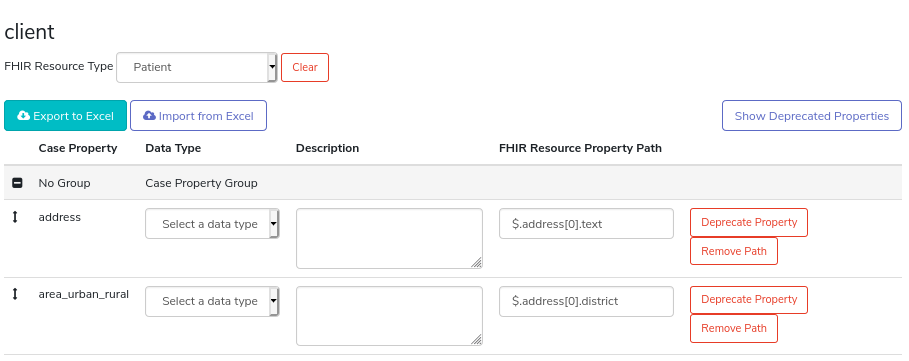

CommCare FHIR Integration
=========================

CommCare HQ offers three ways of sharing data over FHIR:

#. Data forwarding allows CommCare cases to be sent to remote FHIR
   services.
#. The FHIR Importer fetches resources from a remote FHIR API and
   imports them as CommCare cases.
#. The FHIR API exposes CommCare cases as FHIR resources.

FHIR-related functionality is enabled using the "FHIR integration"
feature flag.

.. contents:: :local:

.. toctree::
   fhir_repeater
   fhir_import_config
   fhir_api

.. _data-dictionary-mapping:

Mapping case properties using the Data Dictionary
-------------------------------------------------

The FHIR Resources to be sent by data forwarding, or shared by the FHIR
API, are configured using the Data Dictionary. (Under the "Data" menu,
choose "View All", and navigate to "Data Dictionary")

The Data Dictionary is enabled using the "Data Dictionary" feature flag.

For example, let us imagine mapping a "person" case type to the
"Patient" FHIR resource type. You would select the "person" case type
from the list of case types on the left.

Set the value of the "FHIR ResourceType" dropdown to "Patient".

The Data Dictionary supports simple mapping of case properties. You will
see a table of case properties, and a column titled "FHIR Resource
Property Path". This is where to enter the `JSONPath`_ to the resource
property to set.

An example will help to illustrate this: Imagine the "person" case type
has a "first_name" case property, and assume we want to map its value
to the patient's given name.

#. Check the structure of a `FHIR Patient`_ on the HL7 website.

#. Note Patient.name has a cardinality of "0..*", so it is a list.

#. Check the `HumanName`_ datatype.

#. Note Patient.name.given also has a cardinality of "0..*".

#. Refer to `JSONPath expression syntax`_ to see how to refer to
   Patient's first given name. ... You will find it is
   ``$.name[0].given[0]``. (To become more familiar with JSONPath,
   playing with the `JSONPath Online Evaluator`_ can be fun and useful.)

#. Fill the value "$.name[0].given[0]" into the "FHIR Resource Property
   Path" field for the "first_name" case property.

#. You can test this using a tool like the `Postman REST Client`_ or the
   RESTED `Firefox add-on`_ / `Chrome extension`_, call the CommCare
   FHIR API endpoint for a patient. e.g.
   ``https://www.commcarehq.org/a/<domain>/fhir/R4/Patient/<case-id>``
   (You will need to configure the REST client for
   `API key authentication`_.) You will get a result similar to the
   following::

       {
         "id": "<case-id>",
         "resourceType": "Patient",
         "name": [
           {
             "given": [
               "Jane"
             ]
           }
         ]
       }

#. Use JSONPath to map the rest of the case properties you wish to
   represent in the Patient resource. For a simpler example, a
   "date_of_birth" case property would be mapped to "$.birthDate".

Playing with the `JSONPath Online Evaluator`_ can be fun and useful way
to become more familiar with JSONPath.

.. _JSONPath: https://goessner.net/articles/JsonPath/
.. _FHIR Patient: https://www.hl7.org/fhir/patient.html#resource
.. _HumanName: https://www.hl7.org/fhir/datatypes.html#HumanName
.. _JSONPath expression syntax: https://goessner.net/articles/JsonPath/index.html#e2
.. _JSONPath Online Evaluator: https://jsonpath.com/
.. _Postman REST Client: https://www.postman.com/product/rest-client/
.. _Firefox add-on: https://addons.mozilla.org/en-US/firefox/addon/rested/
.. _Chrome extension: https://chrome.google.com/webstore/detail/rested/eelcnbccaccipfolokglfhhmapdchbfg
.. _API key authentication: https://confluence.dimagi.com/display/commcarepublic/Authentication#Authentication-ApiKeyauthentication

.. _admin-interface-mapping:

Advanced mapping using the Admin interface
------------------------------------------

The Data Dictionary is meant to offer as simple an interface as possible
for mapping case properties to FHIR resource properties. But what about
FHIR resource properties whose values are not stored in case properties?
Or FHIR resource properties whose data types are not the same as their
corresponding case properties?

This can done using the Admin site, and is accessible to superusers.

Mappings are configured using ValueSource definitions. For more
information about ValueSource, see the
:doc:`Value Source <../value_source>` documentation.

Open the Admin site, and navigate to "FHIR" > "FHIR resource types".

There is a list of case types that have been mapped to resource types.
Filter by domain if the list is long. Select the resource-type/case-type
pair to configure.

Let us imagine we are configuring mappings from a "vaccine_dose" case
type to the "Immunization" FHIR resource type.

If there are already mappings from case properties to resource
properties, they are listed under "FHIR resource properties". They
appear in the "Calculated value source" column, and shown as a JSON
document. e.g.

.. code:: javascript

    {
      "case_property": "vaccine_type_code",
      "jsonpath": "$.vaccineCode.coding[0].code"
    }

Continuing with the vaccineCode example, a remote service will need more
context to make sense of a code. The Admin interface allows us to
specify the coding system that the code applies to. The following two
resource properties specify that the code is a CPT 2021 vaccine code.

.. code:: javascript

    {
      "jsonpath": "$.vaccineCode.coding[0].system",
      "value": "http://www.ama-assn.org/go/cpt"
    }

.. code:: javascript

    {
      "jsonpath": "$.vaccineCode.coding[0].version",
      "value": "2021"
    }

These set the "system" and "version" properties of the Coding instance
to constant values.

Next, let us take a look at mapping a property from a parent case. The
Immunization resource type has a "programEligibility" property. This is
its coding system:

.. code:: javascript

    {
      "jsonpath": "$.programEligibility[0].coding[0].system",
      "value": "http://terminology.hl7.org/CodeSystem/immunization-program-eligibility"
    }

If the value for programEligibility is stored on CommCare's "person"
case type, the parent case of the "vaccine_dose" case, here is how to
specify a value from the "person" case's "eligible" case property:

.. code:: javascript

    {
      "supercase_value_source": {
        "jsonpath": "$.programEligibility[0].coding[0].code",
        "case_property": "eligible"
      },
      "identifier": "parent",
      "referenced_type": "person",
      "relationship": "child"
    }

Casting data types is another important use case for the Admin
interface. Here is an example of how we ensure that an integer is sent
in JSON format as an integer and not a string:

.. code:: javascript

    {
      "case_property": "dose_number",
      "jsonpath": "$.protocolApplied.doseNumberPositiveInt",
      "external_data_type": "cc_integer"
    }

We use the same approach to cast a string of space-separated values to a
list of strings. This is particularly useful for the given names of a
patient:

.. code:: javascript

    {
      "case_property": "given_names",
      "jsonpath": "$.name[0].given",
      "external_data_type": "fhir_list_of_string",
      "commcare_data_type": "cc_text"
    }

For a complete list of the data types available, refer to
`corehq/motech/const.py`_ and `corehq/motech/fhir/const.py`_ in the
source code.

.. note::
    Mappings are not designed for transforming values, just, well,
    mapping them. It is better to do more complex transformations inside
    a CommCare form, and store the result in a hidden value question.
    See the :ref:`multiple-values` section under :doc:`fhir_repeater`
    as an example.

.. _corehq/motech/const.py: https://github.com/dimagi/commcare-hq/blob/master/corehq/motech/const.py#L34
.. _corehq/motech/fhir/const.py: https://github.com/dimagi/commcare-hq/blob/master/corehq/motech/fhir/const.py#L31
