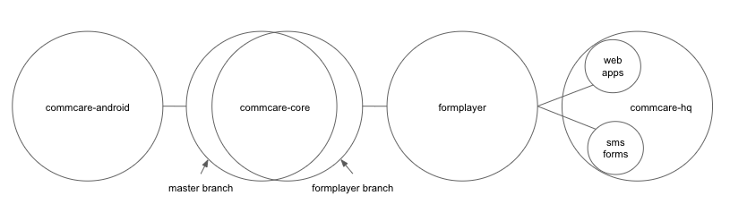

Formplayer in HQ
================

This documentation describes how `formplayer <https://github.com/dimagi/formplayer/>`_ fits into the larger
CommCare system, especially how it relates to CommCare HQ development. For details on building, running, and
contributing to formplayer, see the formplayer repository.

What Is Formplayer?
^^^^^^^^^^^^^^^^^^^

Formplayer is a Java Spring Boot server that wraps `commcare-core <https://github.com/dimagi/commcare-core>`_
and presents its main features as an HTTP API. CommCare HQ's Web Apps, App Preview, and SMS Forms features are
built on top of it:

* Web Apps is a single-page application, inlined into a CommCare HQ template, that provides a web UI backed by the formplayer API.
* App Preview is essentially the same as web apps, but embedded as a cell-phone-shaped iframe within the App Builder.
* SMS Forms serializes a form filling session over SMS in a question / answer sequence that is handled
by the main HQ process, which hits formplayer's API to send answers and get the next question.

Repository Overview
^^^^^^^^^^^^^^^^^^^

* `commcare-android <https://github.com/dimagi/commcare-android>`_: The UI layer of CommCare mobile.
* `commcare-core <https://github.com/dimagi/commcare-core>`_: The CommCare engine, this powers both CommCare mobile and formplayer. Mobile uses the ``master`` branch, while formplayer uses the ``formplayer`` branch. The two branches have a fairly small diff.
* `formplayer <https://github.com/dimagi/formplayer>`_
* `commcare-hq <https://github.com/dimagi/commcare-hq>`_: HQ hosts web apps and the processes that run SMS forms.

Relevant Architectural Decisions
^^^^^^^^^^^^^^^^^^^^^^^^^^^^^^^^

While a full detailing of formplayer's architecture is beyond the scope of this document, a few architectural
decisions are particularly useful for HQ devs who are new to formplayer to understand.

Sandboxes
+++++++++
Sharing the commcare-core code between mobile and formplayer allows us to keep CommCare Android and web apps
essentially compatible. However, because commcare-core was first written for mobile some of the
paradigms it uses make more sense on mobile than on the web. Mobile is offline-first, so submitting
up newly entered data and syncing back down changes others have made are intentional steps designed not to block
someone who was unable to reach the server for hours, days, or longer. That model makes very
little sense on the always-online Web Apps, but the sync/restore process is still a core part of the working model.
There's even a "Sync" button shown to the user in the web apps UI.

Rather than always fetching the latest data from the source of truth, formplayer works off of locally synced subsets of data
like those that would be on people's phones if every user had their own phone. These "sandboxes" are stored as Sqlite DB files,
as they are on the phone. A phone typically has one db file and one user, whereas on formplayer, there
are as many db files as there are users, i.e. tens of thousands. Each file has its own slice of the data synced
down from the source of truth, but always just a little bit out of date if anyone's updated it after their last
sync.

Navigation and replaying of sessions
++++++++++++++++++++++++++++++++++++
User activity in CommCare is oriented around navigating to and then submitting forms. User actions are represented
as a series of "selections" that begin at the app's initial list of menus and eventually end in form entry.

Selections can be:

* An integer index. This is used for lists of menus and/or forms and represents the position of the selected item.
* A case id. This indicates that the user selected the given case.
* The keyword ``action`` and an integer index, such as ``action 0``. This represents the user selecting an action on a detail screen. The index represents the position of the action in the detail's list of actions.

For example, the selections ``[1, 'abc123', 0]`` indicate that a user selected the second visible menu, then selected case
``abc123``, then selected the first visible menu (or form). Note that formplayer determines whether a given
selection is an index, case id, or action based not on the selection itself but on its understanding of the app
structure and the pieces of data needed to proceed to reach a form.

Navigation requests from web apps include a ``selections`` parameter, an array of selections made. Each
request contains the full set of selections, so the example above might map to the following requests:

* ``navigate_menu_start`` to view the first screen, a list of menus
* ``navigate_menu`` with selections ``[1]`` to select the first menu, which leads to a case list
* ``get_details`` with selections ``[1]`` to select a case and show its details
* ``navigate_menu`` with selections ``[1, 'abc123']`` to confirm the case selection, which leads to a list of forms
* ``navigate_menu`` with selections ``[1, 'abc123', 0]`` to select the first form
* ``submit-all`` to submit the form when complete, which sends the user back to the first list of menus

Because formplayer is a RESTful service, each of these individual request plays through all of the given
selections, even those that were already completed earlier. If an early selection contained an expensive operation,
that operation can slow down requests for the rest of the session. Selections that cause side effects will cause
them repeatedly.

Request routing
+++++++++++++++
Each user is tied by a ``formplayer_session`` cookie directly to a machine. The cookie is just a routing hint that
contains the user id but doesn't constitute authentication.  That sticky association only changes if we add or
remove machines, and in that case, the minimum number of associations are changed to rebalance it because we use
`"consistent hashing" <http://nginx.org/en/docs/http/ngx_http_upstream_module.html#hash>`_.
In steady state, one user's requests will always be served by the same machine.

An obvious side effect of that is that if a machine is down, all users assigned to that machine will not be able to do anything until the
machine is back up. During a formplayer deploy, when we have to restart all formplayer processes, a rolling
restart doesn't help uptime, since for every individual user their machine's process will be down while it restarts.

Routing implications for adding and removing machines
-----------------------------------------------------

It's expensive to delete a user's sqlite sandbox, because rebuilding it requires requesting a full restore from
HQ, but it's always **safe** to delete it, because that rebuild from the source of truth will get the user back to
normal. This property makes removing machines a safe operation.
Similarly, adding new machines doesn't pose an issue because the subset of users
that get routed to them will just have their sqlite db file rebuilt on that machine the next time it's needed.
These sandbox db files effectively serve as a cache.

What **does** cause a problem is if a user is associated with machine A, and then gets switched over to machine
B, and then goes back to machine A. In that situation, any work done on machine A wouldn't get synced to machine B
until the next time the user did a "sync" on machine B. Until then, they would be working from stale data. This is
especially a problem for SMS Forms, where the user doesn't have an option to explicitly sync, and where if the
underlying case database switches mid-form or between consecutive forms to a stale one, the user will see very
unintuitive behavior. Formplayer currently doesn't have a concept of "this user has made a request handled by a
different formplayer machine since the last time this machine saw this user"; if it did and it forced a sync in
that situation, that would mostly solve this problem. This problem can show up if you expand the cluster and then
immediately scale it back down by removing the new machines.

Lastly, sqlite db files don't hang around forever. So that stale files don't take up ever more disk, all formplayer
sqlite db files not modified in the last 5 days are regularly deleted. The "5 days" constant is set by
`formplayer_purge_time_spec <https://github.com/dimagi/commcare-cloud/blob/e5871a3dca4c444beb55855a7ba6b8f4e3473c8f/environments/production/public.yml#L61>`_.

Balancing issues for large numbers of machines
----------------------------------------------

Each user has a widely variable amount of traffic, and the more machines there are in the system, the wider the spread
becomes between the least-traffic machine and the most-traffic machine, both statistically and in practice.

If you randomly select 10,000 values from `[1, 10, 100, 100]` and then divide them into `n` chunks,
the sum of the values in each chunk have a wider distribution the
larger `n` is. Here the values represent each user and how much traffic they generate, so this is meant to show
that the more machines you have for a fixed number of users using this rigid load balancing method, the wider the
spread is between the least-used and most-used machine.

This means that fewer, larger machines is better than more smaller machines. However, we have also found
that formplayer performance drops sharply when you go from running on
machines with 64G RAM and 30G java heap to machines with 128G RAM and (still) 30G java heap. So for the time being
our understanding is that the max machine size is 64G RAM to run formplayer on. This, of course, limits our ability
to mitigate the many-machines load imbalance problem.
