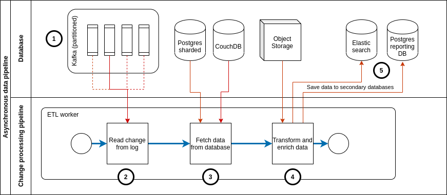

CommCare Architecture Overview
==============================

CommCare Backend Services
-------------------------

The majority of the code runs inside the server process. This contains all of the data models and services that
power the CommCare website.

Each module is a collection of one or more Django applications that each contain the relevant data models, url
mappings and view controllers, templates, and Database views necessary to provide that module’s functionality.

Data flow for forms and cases
-----------------------------

CommCare deals with many different types of data but the primary data that is generated by users form and case data.
This data most often comes from a mobile device running the CommCare mobile application. It may also come from
Web Apps, via an integration API or from a case import.

The data processing for form and case data is split into two portions, synchronous processing and asynchronous
processing.

Synchronous processing
~~~~~~~~~~~~~~~~~~~~~~
Form and case data in CommCare always follows the same pathway through the system regardless of whether the data
originated from a mobile device (as in the diagram below), from Web Apps, an external integration or from an
internal process such as case update rules.

In all instances a form (which may contain zero or more case changes) is received by CommCare and processed
synchronously and atomically to the point of persisting it in the primary databases and recording the
change in the change log.

The diagram below shows this synchronous processing:

1. A form is created on a mobile device (this could also be Web Apps, an external system).
2. The form is received by CommCare and once the request has been authenticated and authorized it is fully processed
   before responding with a success or error response.
3. The data is persisted to the various backend data sources.

  1. This SQL database is used for authentication and authorization.
  2. A set of partitioned SQL databases form the primary data store for form and case data.
  3. Once processing is complete a metadata record is published to the change log for each data model
     that was created or updated.
  4. The raw form XML is persisted to object storage (only metadata about the form is saved to the primary
     database in (b).
  5. If this submission is from a mobile device the sync record for the device is updated to allow efficient
     synchronization when the mobile device next makes a sync request.

4. A successful response is sent to the sender.

Asynchronous data pipeline
~~~~~~~~~~~~~~~~~~~~~~~~~~
Separately from the synchronous workflow described above there is a data processing pipeline
which runs asynchronously. This pipeline is responsible for populating the secondary
databases which are used for reporting and as the datasource for some of the APIs that
CommCare offers.

1. Kafka stores the metadata about data model changes. Kafka partitions the data based on the data model ID
   (case ID / form ID) and stores each partition separately. Data is sent to Kafka during the synchronous
   request processing as described above.
2. A pool of ETL workers (a.k.a. pillows) subscribe to Kafka and receive the metadata records from the partitions
   they are subscribed to.

  a. Each ETL worker subscribes to a unique set of partitions.
  b. Since each worker is independent of the others the rate of processing can vary between workers or can get
     delayed due to errors or other external factors.
  c. The impact of this is that data liveness in the secondary database may vary based on the specific components
     in the pipeline. I.e. two cases which got updated in the same form may be updated in Elasticsearch at different
     times due to variations in the processing delay between pillow workers.

3. The ETL workers fetch the data record from the primary database.

  a. For forms and cases this data comes from PostgreSQL
  b. For users and applications this data comes from CouchDB

4. If the data model is a form then the form XML is also retrieved from object storage. This data together with the
   record from the primary database are used to produce the final output which is written to the secondary databases.

  a. In the case of UCRs there may be other data that is fetched during the processing stage e.g. locations, users.

Change Processors (Pillows)
---------------------------

Change processors (known in the codebase as pillows) are events that trigger when changes are introduced to the
database. CommCare has a suite of tools that listen for new database changes and do additional processing based on
those changes. These include the analytics engines, as well as secondary search indices and custom report
utilities. All change processors run in independent threads in a separate process from the server process, and are
powered by `Apache Kafka <https://kafka.apache.org/>`_.

Task Queue
----------

The task queue is used for asynchronous work and periodic tasks. Processes that require a long time and significant
computational resources to run are put into the task queue for asynchronous processing. These include data exports,
bulk edit operations, and email services. In addition the task queue is used to provide periodic or scheduled
functionality, including SMS reminders, scheduled reports, and data forwarding services. The task queue is powered
by Celery_, an open-source, distributed task queueing framework.

.. _Celery: https://docs.celeryproject.org

Data Storage Layer
------------------

CommCare HQ leverages the following databases for its persistence layer.

PostgreSQL
~~~~~~~~~~

A large portion of our data is stored in the PostgreSQL_ database, including case data, form metadata, and user
account information.

Also stored in a relational database, are tables of domain-specific transactional reporting data. For a particular
reporting need, our User Configurable Reporting framework (UCR) stores a table where each row contains the relevant
indicators as well as any values necessary for filtering.

For larger deployments the PostgreSQL database is sharded. Our primary data is sharded using a library called
PL/Proxy as well as application logic written in the Python.

PostgreSQL is a powerful, open source object-relational database system. It has more than 15 years of active
development and a proven architecture that has earned it a strong reputation for reliability, data integrity, and
correctness.

See :ref:`commcare_postgresql_configuration`

.. _PostgreSQL: https://www.postgresql.org

CouchDB
~~~~~~~

CommCare uses CouchDB_ as the primary data store for some of its data models, including the application builder
metadata and models around multitenancy like domains and user permissions. CouchDB is an open source database
designed to be used in web applications. In legacy systems CouchDB was also used to store  forms, cases, and SMS
records, though these models have moved to PostgreSQL in recent applications.

CouchDB was primarily chosen because it is completely schema-less. All data is stored as JSON documents and views
are written to index into the documents to provide fast map-reduce-style querying.

In addition CommCare leverages the CouchDB changes feed heavily to do asynchronous and post processing of our data.
This is outlined more fully in the “change processors” section above.

.. _CouchDB: https://couchdb.apache.org/

Elasticsearch
~~~~~~~~~~~~~

Elasticsearch_ is a flexible and powerful open source, distributed real-time search and analytics engine for the
cloud. CommCare uses Elasticsearch for several distinct purposes:

Much of CommCare's data is defined by users in the application configuration. In order to provide performant
reporting and querying of user data CommCare makes use of Elasticsearch.

CommCare also serves portions of the REST API from a read-only copy of form and case data that is replicated in
real time to an Elasticsearch service.

This also allows independent scaling of the transactional data services and the reporting services.

.. _Elasticsearch: https://www.elastic.co/

Devops Automation
-----------------

Fabric / Ansible
~~~~~~~~~~~~~~~~

Fabric and Ansible are deployment automation tools which support the efficient management of cloud resources for
operations like deploying new code, rolling out new server hosts, or running maintenance processes like logically
resharding distributed database. CommCare uses these tools as the foundation for our cloud management toolkit,
which allows us to have predictable and consistent maintenance across a large datacenter.

Dimagi's tool suite, `commcare-cloud <https://dimagi.github.io/commcare-cloud/>`_ is also available on Github

Other services
--------------

Nginx (proxy)
~~~~~~~~~~~~~

CommCare’s main entry point for all traffic to CommCare HQ goes through Nginx_. Nginx performs the following
functions:

* SSL termination
* Reverse proxy and load balancing
* Request routing to CommCare and Formplayer
* Serving static assets
* Request caching
* Rate limiting (optional)

.. _Nginx: https://www.nginx.com/

Redis
~~~~~

Redis_ is an open source document store that is used for caching in CommCare HQ. Its primary use is for general
caching of data that otherwise would require a query to the database to speed up the performance of the site. Redis
also is used as a temporary data storage of large binary files for caching export files, image dumps, and
other large downloads.

.. _Redis: https://redis.io/

Apache Kafka
~~~~~~~~~~~~

Kafka_ is a distributed streaming platform used for building real-time data pipelines and streaming apps. It is
horizontally scalable, fault-tolerant, fast, and runs in production in thousands of companies. It is used in
CommCare to create asynchronous feeds that power our change processors (pillows) as part of the reporting pipeline.

.. _Kafka: https://kafka.apache.org/

RabbitMQ
~~~~~~~~

RabbitMQ_ is an open source Advanced Message Queuing Protocol (AMQP) compliant server. As mentioned above CommCare
uses the Celery_ framework to execute background tasks. The Celery task queues are managed by RabbitMQ.

.. _RabbitMQ: https://www.rabbitmq.com/

Gunicorn
~~~~~~~~

Gunicorn_ is an out-of-the-box multithreaded HTTP server for Python, including good integration with Django. It allows
CommCare to run a number of worker processes on each worker machine with very little additional setup. CommCare is
also using a configuration option that allows each worker process to handle multiple requests at a time using the
popular event-based concurrency library Gevent. On each worker machine, Gunicorn abstracts the concurrency and
exposes our Django application on a single port. After deciding upon a machine through its load balancer, our proxy
is then able to forward traffic to this machine’s port as if forwarding to a naive single-threaded implementation
such as Django’s built-in "runserver".

.. _Gunicorn: https://gunicorn.org/
