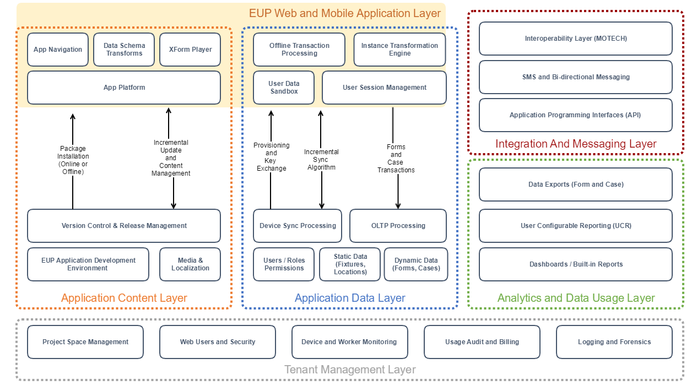
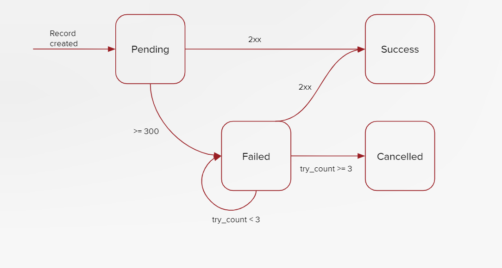

CommCare HQ Platform Overview
=============================

The major functional components are:

* Application Building and Content Management
* Application Data Layer
* Tenant Management
* Analytics and Usage
* Messaging Layer
* Integration

Application Content Layer
-------------------------

Application Building and Deployment Management
~~~~~~~~~~~~~~~~~~~~~~~~~~~~~~~~~~~~~~~~~~~~~~

The Application Builder provides an interface for users to create and structure an application’s content and
workflow. Questions can be added by type (text, integer, multiple answer, date, etc.) and logic conditions can be
applied to determine whether the question should be displayed or if the answer is valid.

This environment also provides critical support for detailed management of content releases. CommCare’s deployment
management provides a staging-to-deploy pipeline, profile-based releases for different regions, and supports
incremental rollout and distribution for different regions.

Android Mobile App Runner and Web App Engine
~~~~~~~~~~~~~~~~~~~~~~~~~~~~~~~~~~~~~~~~~~~

Applications developed in the end user programming (EUP) content builder are deployed to users and then executed
within the CommCare application engine, which is built on a shared Java codebase.  The application configurations
can be run on both a native Android client and a Spring web client, to allow access for users in the  field as well
as those accessing the application from a computer on the web.

Application Data Layer
----------------------

Data Management
~~~~~~~~~~~~~~~

The underlying data model for CommCare uses forms and cases to track interactions with objects, often people. Cases
provide longitudinal records which can track the ongoing interactions with a case through form submissions and
facilitate the complex sharding and reconciliation required from synchronizing offline clients.

Every time a form is filled out, it can either create a new case, update an existing case, or close an existing
case. Each case has a type, such as “patient”, or “contact”, which distinguishes it from cases of other types.
Cases may also be structured in a hierarchy using subcases, such that a case can be directly linked to its parent
case for maintaining relationships between cases.

Transaction Processing
~~~~~~~~~~~~~~~~~~~~~~

CommCare provides a transaction processing layer which acts as the first step in the underlying data and storage
pipeline. This layer manages the horizontal workload of the mobile and web applications submitting forms, which are
archived into a chunked object storage, and extracts the transactional ‘case’ logic which is used to facilitate
data synchronization through more live storage in the table based storage layer. The transaction processor then
appropriately queues transactions into the real time data pipeline for processing into the dashboard tables through
the Kakfa Change Feed, or triggering asynchronous business rules in the Celery queue.

The data processing service is flexible to store any content sent or received via mobile form submissions or SMS
services as long as it adheres to the XForms specification. It also saves all logging and auditing information
necessary for data security compliance. The data processing service saves all data at the transactional level so
that histories can be audited and reconstructed if necessary.

Synchronization
~~~~~~~~~~~~~~~

The synchronization process allows for case and user data to be kept up-to-date through incremental syncs of
information from the backend server for offline use cases. To ensure consistency, the backend keeps a shadow record
of each user’s application state hashed to a minimal format, when users submit data or request synchronization,
this shadow record hash is kept up to date to identify issues with what local data is on device.

Syncs request a diff from the server by providing their current hashed state and shadow record token. The server
then establishes what cases have been manipulated outside of the local device’s storage (along with reports or
other static data) which may be relevant to the user, such as a new beneficiary or household registered in their
region. After all of those cases are established, the server produces an XML payload similar to the ones generated
by filling out forms on the local device, which is used to update local device storage with the new data.

Tenant Management Layer
-----------------------

Project Spaces
~~~~~~~~~~~~~~

Every project has its own site on CommCare HQ. Project spaces can house one, or more than one inter-related
applications. Data is not shared among project spaces.

Content can be centrally managed with a master project space housing a master application that can be replicated in
an unlimited number of additional project spaces. CommCare enables fine grained release management along with
roll-back that can be controlled from each project space.  These project spaces can be managed under an Enterprise
Subscription that enables centralized control and administration of the project spaces.

User Management
~~~~~~~~~~~~~~~

There are two main user types in CommCare: Project Users and Application Users.

Project Users are meant to view data, edit data, manage exports, integrations, and application content.  Project
Users can belong to one or more project spaces and are able to transition between project spaces without needing to
login/logout by simply selecting from a drop-down.

Application Users are expected to primarily use CommCare as an end-user entering data and driving workflows through
an application.

Project Users and Application Users are stored with separate models. These models include all permission and
project space membership information, as well as some metadata about the user such as their email address,
phone number, etc. Additionally, authentication stubs are synchronized in real time to SQL where they are saved as
Django Users, allowing us to use standard Django authentication, as well as Django Digest, a third-party Django
package for supporting HTTP Digest Authentication.

Device and Worker Monitoring
~~~~~~~~~~~~~~~~~~~~~~~~~~~~

Mobile devices which are connected to the CommCare server communicate maintenance and status information through a
lightweight HTTP ‘heartbeat’ layer, which receives up-to-date information from devices like form throughput and
application health, and can transmit back operational codes for maintenance operations, allowing for remote
management of the application directly outside of a full-fledged MDM.

Analytics and Usage
-------------------

There are several standard reports available in CommCare.  The set of standard reports available are organized into
four categories: Monitor Workers, Inspect Data, Messaging Reports and Manage Deployments.

**Monitor Workers**

Includes reports that allow you to view and compare activity and performance of end
workers against each other.

**Inspect Data**

Allows diving into individual data reports

**Messaging Reports**

Domains that leverage CommCare HQ’s messaging capabilities have an additional reporting
section for tracking SMS messages sent and received through their domain

**Manage Deployments**

Provides tools for looking at applications deployed to users’ phones and device logging
information.

Mobile Reports
~~~~~~~~~~~~~~

CommCare has the ability to perform basic data transforms and accumulations with a “User Configurable Reports”
(UCR) engine.

Messaging Layer
--------------

CommCare Messaging integrates with a SMS gateway purchased and maintained by the client as the processing layer for
SMS messages. This layer manages the pipeline from a Case transaction to matching business logic rules to message
scheduling and validation.

Conditional Scheduled Messages
~~~~~~~~~~~~~~~~~~~~~~~~~~~~~~

Every time a case is created, updated, or closed in a form it is placed on the asynchronous processing queued.
Asynchronous processors review any relevant business logic rules to review whether the case has become (or is no
longer) eligible for the rule, and schedules a localized message which can contain information relevant to the
case, such as an individual who did not receive a scheduled visit.

Broadcast Messages
~~~~~~~~~~~~~~~~~~

Broadcast messaging is used to send ad-hoc messages to users or cases. These messages can either be sent
immediately, or at a later date and time, and can also be configured to send to groups of users in the system.

Gateway Connectivity and Configuration, Logging, and Audit Tracking
~~~~~~~~~~~~~~~~~~~~~~~~~~~~~~~~~~~~~~~~~~~~~~~~~~~~~~~~~~~~~~~~~~~

All SMS traffic (inbound and outbound) is logged in the CommCare Message Log, which is also available as a report.
In addition to tracking the timestamp, content, and contact the message was associated with, the Message Log also
tracks the SMS backend that was used and the workflow that the SMS was a part of (broadcast message, reminder, or
keyword interaction).

The messaging layer is also used to provide limits and controls on messaging volume, restricting the number of
messages which can be sent in a 24hr period, and restricting the time of day which messages will be sent, to comply
with regulations. These restrictions may apply to both ad-hoc and scheduled messages. Messages are still processed
and queued 24hrs per day, but only submitted when permitted.

Messaging Dashboards
~~~~~~~~~~~~~~~~~~~~

Charts and other kinds of visualizations are useful for getting a general overview of the data in your system. The
dashboards in CommCare display various graphs that depict case, user, and SMS activity over time. These graphs
provide visibility into when new cases and users were created, how many SMS messages are being sent daily, and the
breakdown of what those messages were used for (reminders, broadcasts, etc.).

Integration
-----------

CommCare has robust APIs as well as a MOTECH integration engine that is embedded in CommCare.  APIs allow for
direct programmatic access to CommCare.  The MOTECH integration engine allows for custom business rules to be
implemented that allow for real-time or batch integration with external systems.  This engine does not have an
application or content management environment, and so requires custom engineering to be added to a CommCare
instance.

APIs
~~~~

CommCare has extensive APIs to get data in and out for bidirectional integration with other systems. This method of
data integration requires familiarity with RESTful HTTP conventions, such as GET and POST and url parameters.
Character encoding is UTF-8. Dates should be compliant ISO 8601. In some cases CommCare uses RFC 3339, but is
moving towards ISO 8601. Guides should be generated in accordance with RFC 4122. Documented APIs and use of
Standards are readily available.

There are APIs both for reading and writing data to CommCare.  This can be updated data related to forms or cases
in the system and enable highly-sophisticated integrations with CommCare.  Below is an example subset of the
RESTful APIs available on CommCare.

MOTECH Repeaters
~~~~~~~~~~~~~~~~

For interoperability with external systems which process transactional data, CommCare has a MOTECH repeater layer,
which manages the pipeline of case and form transactions received and manages the lifecycle of secure outbound
messages to external systems.

This architecture is designed to autonomously support the scale and volume of transactional data required for
tens-to-hundreds of millions of transactions will be processed in a 24hr period.

New transformation code for this subsystem can be authored as Python code modules for each outbound integration.
These modules can independently transform the transactional data for the repeater layer, or rely on other data
from the application layer when needed by integration requirements.
