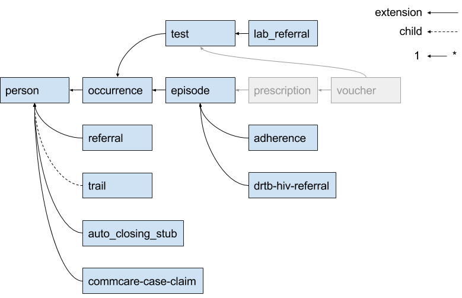

===========================
Device Restore Optimization
===========================

This document is based on the definitions and requirements for restore logic
outlined in `new-idea-for-extension-cases.md`_.

Important terms from that document that are also used in this document:

.. _available:

A case is **available** if

- it is **open** and not an **extension** case
- it is **open** and is the **extension** of an **available** case.

.. _live:

A case is **live** if any of the following are true:

- it is **owned** and **available**
- it has a **live child**
- it has a **live extension**
- it is **open** and is the **exension** of a **live** case

Dealing with shards
-------------------

Observation: the decision to shard by case ID means that the number of levels in
a case hierarchy impacts restore performance. The minimum number of queries
needed to retrieve all live_ cases for a device can equal the number of levels
in the hierarchy. The maximum is unbounded.

Since cases are sharded by case ID...

- Quotes from `How Sharding Works`_

  - Non-partitioned queries do not scale with respect to the size of cluster,
    thus they are discouraged.
  - Queries spanning multiple partitions ... tend to be inefficient, so such
    queries should be done sparingly.
  - A particular cross-partition query may be required frequently and
    efficiently. In this case, data needs to be stored in multiple partitions to
    support efficient reads.

- Potential optimizations to allow PostgreSQL to do more of the heavy lifting
  for us.

  - Shard ``case_index`` by domain.

    - Probably not? Some domains are too large.

  - Copy related case index data into all relevant shards to allow a query to
    run on a single shard.

    - Nope. Effectively worse than sharding by domain: would copy entire case
      index to every shard because in a given set of live_ cases that is the
      same size as or larger than the number of shards, each case will probably
      live in a different shard.

  - Re-shard based on ownership rather than case ID

    - Maybe use hierarchical keys since ownership is strictly hierarchical. This
      may simplify the sharding function.
    - Copy or move data between shards when ownership changes.

.. TODO verify "ownership is strictly hierarchical" mentioned above

.. _How Sharding Works: https://medium.com/@jeeyoungk/how-sharding-works-b4dec46b3f6

Data Structure
--------------

Simplified/minimal table definitions used in sample queries below. ::

  cases
    domain        char
    case_id       char
    owner_id      char
    is_open       bool

  case_index
    domain        char
    parent_id     char
    child_id      char
    child_type    enum (CHILD|EXTENSION)

Presence of a row in the ``case_index`` adjacency list table implies that the
referenced cases are available_. The ``case_index`` is updated when new data is
received during a device sync: new case relationships are inserted and
relationships for closed cases are deleted. All information in the
``case_index`` table is also present in the ``CommCareCaseIndexSQL`` and
``CommCareCaseSQL`` tables. Likewise for the ``cases`` table, which is a subset
of ``CommCareCaseSQL``.

Case Study: UATBC case structure
--------------------------------

Sources: `eNikshay App Design and Feedback - Case Structure`_ and
`case_utils.py`_. These sources contain conflicting information. For example:

- `case_utils.py`_ references *prescription* and *voucher* while the sheet_
  does not.
- `case_utils.py`_ has *referral* related to *episode*, not *person* as in the
  sheet_.

With the current sharding (by case ID) configuration, the maximum number of
queries needed to get all live_ cases for a device is 5 because there are 5
levels in the case hierarchy. Update: this is wrong; it could be more than 5.
Example: if a case retrieved in the 5th query has unvisited children, then at
least one more query is necessary. Because any given case may have multiple
parents, the maximum number of queries is unbounded.

.. _eNikshay App Design and Feedback - Case Structure: https://docs.google.com/spreadsheets/d/1yNvDsWOnryTYooMs1snAQ3pD1R6wfSQN_1ICZbvKhXU/edit?pli=1#gid=670651589
.. _case_utils.py: https://github.com/dimagi/commcare-hq/blob/master/custom/enikshay/case_utils.py
.. _sheet: `eNikshay App Design and Feedback - Case Structure`_

Algorithm to minimize queries while sharding on case ID
-------------------------------------------------------

The algorithm (Python):

.. code-block:: python

  next_ids = get_cases_owned_by_device(owner_ids)
  live_ids = set(next_ids)
  while next_ids:
      related_ids = set(get_related_cases(next_ids))
      if not related_ids:
          break
      next_ids = related_ids - live_ids
      live_ids.update(related_ids)

All queries below are simplified for the purposes of demonstration. They use the
simplified table definitions from the `Data Structure`_ section in this
document, and they only return case IDs. If this algorithm is implemented it
will likely make sense to expand the queries to retrieve all case data,
including case relationship data, and to query directly from
``CommCareCaseIndexSQL`` and ``CommCareCaseSQL``.

The term “child” is a general term used to refer to a case that is related to
another case by retaining a reference to the other case in its set of parent
indices. It does not refer to the more restrictive “child” relationship type.

Definitions:

- ``OWNER_DOMAIN`` - the domain for which the query is being executed.
- ``OWNER_IDS`` - a set of user and group IDs for the device being restored.
- ``NEXT_IDS`` - a set of live_ case IDs.

``get_cases_owned_by_device()`` retrieves all open cases that are not extension
cases given a set of owner IDs for a device. That is, it retrieves all live_
cases that are directly owned by a device (user and groups). The result of this
function can be retrieved with a single query:

.. code-block:: sql

  select cx.case_id
  from cases cx
    left outer join case_index ci
      on ci.domain = cx.domain and ci.child_id = cx.case_id
  where
    cx.domain = OWNER_DOMAIN and
    cx.owner_id in OWNER_IDS and
    (ci.child_id is null or ci.child_type != EXTENSION) and
    cx.is_open = true

``get_related_cases()`` retrieves all live_ cases related to the given set of 
live_ case IDs. The result of this function can be retrieved with a single
query:

.. code-block:: sql

  -- parent cases (outgoing)
  select parent_id, child_id, child_type
  from case_index
  where domain = OWNER_DOMAIN
    and child_id in NEXT_IDS
  union
  -- child cases (incoming)
  select parent_id, child_id, child_type
  from case_index
  where domain = OWNER_DOMAIN
    and parent_id in NEXT_IDS
    and child_type = EXTENSION

The ``IN`` operator used to filter on case ID sets `should be optimized`_ since
case ID sets may be large.

Each of the above queries is executed on all shards and the results from each
shard are merged into the final result set.

.. _should be optimized: https://dba.stackexchange.com/questions/91247/optimizing-a-postgres-query-with-a-large-in

One query to rule them all.
---------------------------

Objective: retrieve all live_ cases for a device with a single query. This query
answers the question `Which cases end up on a user's phone?`_ The sharding
structure will need to be changed if we want to use something like this.

.. code-block:: sql

  with owned_case_ids as (
    select case_id
    from cases
    where
      domain = OWNER_DOMAIN and
      owner_id in OWNER_IDS and
      is_open = true
  ), recursive parent_tree as (
    -- parent cases (outgoing)
    select parent_id, child_id, child_type, array[child_id] as path
    from case_index
    where domain = OWNER_DOMAIN
      and child_id in owned_case_ids
    union
    -- parents of parents (recursive)
    select ci.parent_id, ci.child_id, ci.child_type, path || ci.child_id
    from case_index ci
      inner join parent_tree as refs on ci.child_id = refs.parent_id
    where ci.domain = OWNER_DOMAIN
      and not (ci.child_id = any(refs.path)) -- stop infinite recursion
  ), recursive child_tree as (
    -- child cases (incoming)
    select parent_id, child_id, child_type, array[parent_id] as path
    from case_index
    where domain = OWNER_DOMAIN
      and (parent_id in owned_case_ids or parent_id in parent_tree)
      and child_type = EXTENSION
    union
    -- children of children (recursive)
    select
      ci.parent_id,
      ci.child_id,
      ci.child_type,
      path || ci.parent_id
    from case_index ci
      inner join child_tree as refs on ci.parent_id = refs.child_id
    where ci.domain = OWNER_DOMAIN
      and not (ci.parent_id = any(refs.path)) -- stop infinite recursion
      and child_type = EXTENSION
  )
  select
    case_id as parent_id,
    null as child_id,
    null as child_type,
    null as path
  from owned_case_ids
  union
  select * from parent_tree
  union
  select * from child_tree

.. _Which cases end up on a user's phone?: https://gist.github.com/dannyroberts/f184daad468fb7debf10#which-cases-end-up-on-a-users-phone

Q & A
-----

- Do we have documentation on existing restore logic?

  - Yes: `new-idea-for-extension-cases.md`_
  - See also `child/extension test cases`_

- `new-idea-for-extension-cases.md`_: "[an extension case has] the ability (like
  a child case) to go out in the world and live its own life."

  What does it mean for an extension case to "live its own life"? Is it
  meaningful to have an extension case apart from the parent of which it is an
  extension? How are the attributes of an extension case "living its own life"
  different from one that is not living it's own life (I'm assuming _not living
  its own life_ means it has the same lifecycle as its parent).

  - Danny Roberts:

      haha i mean that may have been a pretty loosely picked phrase

      I think I specifically just meant you can assign it an owner separate from
      its parent’s

- Is there an ERD or something similar for UATBC cases and their relationships?

  - `Case structure diagram`_ (outdated)
  - `SDD _EY Comments_v5_eq.docx`_ (page 24, outdated)
  - `eNikshay App Design and Feedback - Case Structure`_ - Kriti
  - `case_utils.py`_ - Farid

.. _new-idea-for-extension-cases.md: https://gist.github.com/dannyroberts/f184daad468fb7debf10
.. _child/extension test cases: https://github.com/dimagi/commcare-core/blob/master/src/test/resources/case_relationship_tests.json
.. _Case structure diagram: https://www.dropbox.com/work/UATBC/Tech/SDD?preview=UATBC-+System+Design+Document+(SDD)+-+Case+Structure.jpg
.. _SDD _EY Comments_v5_eq.docx: https://www.dropbox.com/work/UATBC/tech/SDD?preview=SDD+_EY+Comments_v5_eq.docx
.. _eNikshay App Design and Feedback - Case Structure: https://docs.google.com/spreadsheets/d/1yNvDsWOnryTYooMs1snAQ3pD1R6wfSQN_1ICZbvKhXU/edit?pli=1#gid=670651589
.. _case_utils.py: https://github.com/dimagi/commcare-hq/blob/master/custom/enikshay/case_utils.py

