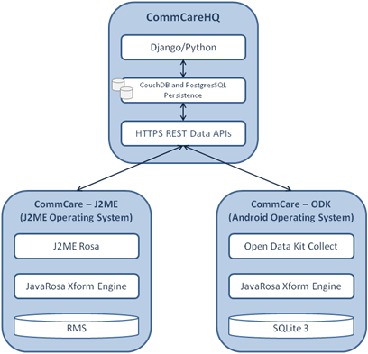

CommCare Technical Overview
=========================== 

Introduction
------------

CommCare is an open source mobile health platform which consists of two
main technology components: CommCare Mobile and CommCareHQ. CommCare
enables easy electronic data collection, decision support, and
patient/case management. The mobile application is used by client-facing
community health workers in visits as a data collection and educational
tool and includes optional audio, image, and video prompts. The web
application provides reporting, analytics dashboards, user/domain
management, and data viewing and analysis. This document serves to
describe, in detail, the technology components of CommCare.

CommCare Architecture Diagram
-----------------------------

|image0|

CommCare Standards
------------------

The CommCare application is built on top of OpenRosa
`http://openrosa.org/ <http://openrosa.org/>`__ standard tools and
protocols, and leverages many different open-source technologies.
Protocols are represented using XForms,
`http://www.w3.org/MarkUp/Forms/ <http://www.w3.org/MarkUp/Forms/>`__ a
W3C backed standard approach to more advanced forms that support nested
and repeatable elements, decision support, advanced validation, and
extensive user interface controls. In addition, CommCare leverages
several OpenRosa standard APIs which are all documented at
`https://confluence.dimagi.com/display/commcarepublic/CommCare+HQ+APIs <https://confluence.dimagi.com/display/commcarepublic/CommCare+HQ+APIs>`__.

CommCare Mobile communicates with CommCare HQ with XML-payloads
delivered via secure HTTPS APIs. Form submissions are HTTPS POSTs of
XForm instance files, and case synchronization is performed via
digest-authenticated HTTPS GETs.

CommCare Mobile
---------------

CommCare Mobile is a phone or tablet-based client application for data
collection and service delivery. It supports two primary mobile
platforms: J2ME and Android. The J2ME application is meant for lower-end
feature phones and is supported by a variety of platforms, most notably
the Symbian operating system found on most Nokias. The Android version
is meant for higher-end phones and tablets. Both applications (J2ME and
Android) are driven by an XML application configuration layer which can
be developed using CommCareHQ's application builder, or hand-authored
for advanced or cutting-edge deployments. Both implementations maintain
the same transaction protocol for creating and accessing persistent
data, allowing them to be used interchangeably for a deployment. The
external application layer is versioned, to allow applications to
receive updates with minimal bandwidth required.

At the core of the application layer is JavaRosa, an open-source player
for the public XForms standard. Both applications are written in Java on
top of existing open-source tools (JavaRosa, J2MERosa, and Open Data Kit
(ODK) Collect). JavaRosa's XForms engine allows for users to enter data
with advanced skip logic, validation, and sensor (GPS, camera, etc)
integration where available. XForms are written in a portable XML
format, making available a myriad of authoring tools and entry options.

CommCare's mobile application maintains a persistence layer for data
collected on the device or fetched from a remote server. Information
captured in filled in forms is stored on the device until it is able to
be synced with the server, at which point the records are deleted. This
allows CommCare to queue up forms while offline and synchronize records
when a network connection is available. Information related to open case
records is stored permanently on the phone until the cases are closed.
The entire CommCare database can optionally be stored encrypted for
additional security. In line with the generally accepted platform
standards, the J2ME data is stored in the phone's record management
store (RMS), while on Android it is stored in an application-specific
sqlite3 database.

The mobile client supports internationalization through the standard
itext elements in XForms, allowing forms to be translated into any
number of languages (multiple language support at a time) and character
scripts. Depending on platform support, many different question types
beyond the standard text, date, numeric, and select-from-a-list are
possible, including GPS tagging, image capture using the phone's camera,
audio and video recording, and barcode reading. The mobile client also
supports multimedia question content via external itext references.
Available multimedia types are images (displayed with the question), and
audio and 3gp video playback (playable on demand when viewing the
question). A question can have multiple multimedia references,
supporting a rich and educational user interaction.

CommCareHQ
----------

`CommCareHQ`_, the second technology component, is CommCare's web-based
tool for application management and reporting. CommCareHQ receives the
form submissions from CommCare Mobile. CommCareHQ is written in Python
using the `Django web framework`_. Our database backend is primarily
`CouchDB`_ with a small Postgres component, primarily for compatibility
with some of Django's built-in capabilities – specifically user
management and authentication.

CouchDB was chosen as a data store because it is web-scale and
schemaless. Schemaless data is a good choice for forms because changes
to the form do not have to result in costly changes to the database
schema. This allows CommCareHQ to accept and process any form submission
– even one it has never seen before, since the structure does not need
to be known in advance. XML submissions are immediately parsed into a
JSON representation understood by CouchDB and saved.

Additionally, because CouchDB is a database built for the web it enables
CommCareHQ to scale as the user base and data store grows. Web reports
are primarily based off of map/reduce CouchDB views, which are written
in JavaScript. Map/reduce allows extremely fast aggregation of large
amounts of data, making it well suited for monitoring a distributed CHW
workforce.

Another major component of CommCare HQ is its form-builder. The form
builder is written entirely in JavaScript using the popular open-source
library `JQuery`_. This is important because it means that the entire
form can be designed while offline You do have to be online to load the
form builder and save your changes, an important requirement for many
of our users who build forms while in regions of the world with
extremely unreliable internet. In addition to the form-builder, CommCare
HQ allows you to customize your application in many other ways,
including how to organize forms into modules, and what data from each
form should be persisted in the case record. Applications are versioned,
so you can revert back to previous versions of an application if you
make mistakes while changing it. Each version is a wholesale copy of the
entire application.

All access to CommCareHQ including mobile submissions is done over HTTPS
and is cryptographically secure. The system is secure and HIPAA
compliant. CommCareHQ also acts as a portal to the data received from
CommCare Mobile deployments. In addition to allowing you to export all
of your data as excel files, it also provides a number of pre-made
reports that give you a view into the performance of your community
health workers. The pre-made reports are compiled off of generic data
that all compliant submissions are ensured to have, such as the CHW's
ID, the time on the device when the CHW started and ended filling out
the form, and the time it was received on the server. Some reports also
use the case data that is automatically compiled from forms about the
same patient or issue (as configured in that particular application),
letting you see for example how well a CHW is following up on her
patients.

Finally you can export your data in two basic forms: either as a list of
the submissions, organized by type of form, or as a list of all cases,
in which the original submissions have been boiled down to one line per
case that the CHWs have opened. While you can technically reconstruct
the case data yourself from the individual submissions, it is less
error-prone to use the list that CommCareHQ has already compiled. For
people who want to have programmatic access to their data for
integration with their data analysis system, we also provide a data
:doc:`export API <export_api>`.

.. _CommCareHQ: https://www.commcarehq.org/
.. _Django web framework: https://www.djangoproject.com/
.. _CouchDB: http://wiki.apache.org/couchdb/
.. _JQuery: http://jquery.com/

