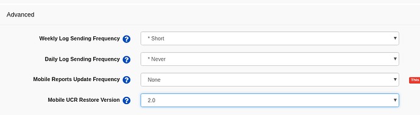
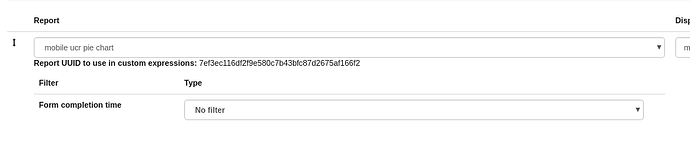

Migrating to Mobile UCR Restore V2
==================================

Evolution of Mobile UCR Restore Versions
----------------------------------------
Historically, there have been three versions for how Mobile UCRs were sent to mobile devices:

- **Version 1.0**: All reports are bundled together into a single fixture during the mobile sync process.
- **Version 1.5**: Both V1 and V2 are supported together. This is used to migrate from V1 without causing any breaking changes.
- **Version 2.0**: Enhanced performance where each report has a fixture of its own.

Deprecation of Mobile UCR V1 and V1.5
-------------------------------------
Both V1 and V1.5 have been deprecated to address the performance challenges encountered with these versions.

Benefits of Upgrading to Mobile UCR V2
--------------------------------------
The introduction of Mobile UCR V2 offers significant performance and efficiency improvements around how UCR data is sent over to the mobile app and synced.
These improvements offer faster report lookups and mobile syncs, as well as a new sync delay option for each report that allows administrators to control
how frequently report data is synced.

Moving to Mobile UCR V2
-----------------------
- Applications that do not have any references to UCRs in forms, case lists and filters need only have their
  Mobile UCR Version updated to V2 and the app will continue working as normal.
- Applications with references to reports will need to have all manual references to the `commcare:reports`
  fixture changed to `commcare-reports:{report-UUID}` before updating to V2.
  These are most likely to be contained in reports modules, but others may be in case lists. Please refer to
  "Update Application Manual References" for more details.

Update Mobile UCR Version
-------------------------
In the app settings, in the "Advanced Setting" tab, you'll find "Mobile UCR Restore Version".
Set the version to '2.0' if your application does not have any references to UCRs.

Update Application Manual References
------------------------------------
Applications with references to reports will need to have all manual references to
the `commcare:reports` fixture changed before updating to V2. This involves making the following change:

- **V1**: `<instance id="reports" src="jr://fixture/commcare:reports"/>`
- **V2**: `<instance id="commcare-reports:{UUID}" src="jr://fixture/commcare-reports:{UUID}"/>`

The V1 example should be replaced with the V2 example for each report that is to be added.

To do this, you will need the UUID for each report which can be found in the Reports
module in the report definition.

You can change any reports references by using this format as a guide
("c47c48..." is the UUID for the example report)

.. list-table::
   :header-rows: 1
   :widths: 20 40 40

   * -
     - V1
     - V2
   * - **Report references**
     - ``instance('reports')/reports/report[@id='xxxxxxx']``

       ``instance('reports')/reports/report[@id='c47c48993851c09a152b91614ee1f6592fc2dd37']/rows/row[@is_total_row='False']``
     - ``instance('commcare-reports:xxxxxxx')``

       ``instance('commcare-reports:c47c48993851c09a152b91614ee1f6592fc2dd37')/rows/row[@is_total_row='False']``
   * - **Filters**
     - ``column[@id='Report Column ID'] = value``

       ``column[@id='computed_owner_name_40cc88a0'] = instance('commcaresession')/session/data/report_filter_c47c48993851c09a152b91614ee1f6592fc2dd37_computed_owner_name_40cc88a0_1``
     - ``Report Column ID = value``

       ``computed_owner_name_40cc88a0 = instance('commcaresession')/session/data/report_filter_c47c48993851c09a152b91614ee1f6592fc2dd37_computed_owner_name_40cc88a0_1``
   * - **Column references**
     - ``column[@id='Report Column ID']``

       ``column[@id='computed_owner_name_40cc88a0']``
     - ``Report Column ID``

       ``computed_owner_name_40cc88a0``
