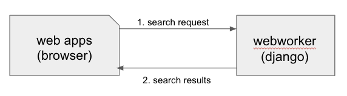
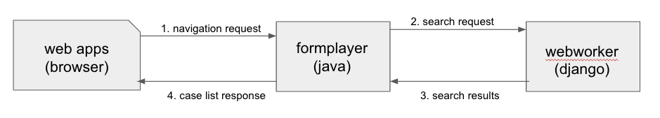

Web Apps JavaScript
~~~~~~~~~~~~~~~~~~~

This document is meant to orient developers to working with Web Apps. Its primary audience is developers who are familiar with CommCare HQ but not especially familiar with CommCare mobile or formplayer.

System Architecture
^^^^^^^^^^^^^^^^^^^

High-level pieces of the system:

- **Web Apps** is a piece of CommCare HQ that allows users to enter data in a web browser, providing a web equivalent to CommCare mobile. Like the rest of HQ, web apps is built on django, but it is much heavier on javascript and lighter on python than most areas of HQ. While it is hosted on HQ, its major "backend" is formplayer.

- `Formplayer <https://github.com/dimagi/formplayer/>`_ is a Java-based service for entering data into XForms. Web apps can be thought of as a UI for this service. In this vein, the bulk of web apps javascript implements a javascript application called "FormplayerFrontend". This makes the word "formplayer" sometimes ambiguous in this document: usually it describes the Java-based service, but it also shows up in web apps code references.

- **CloudCare** is a legacy name for web apps. Web apps code is in the ``cloudcare`` django app. It should not be used in documentation or anything user-facing. It shouldn't be used in code, either, unless needed for consistency. It mostly shows up in filenames and URLs.

Web apps is tightly coupled with formplayer, so check out the `formplayer README <https://github.com/dimagi/commcare-hq/blob/master/docs/formplayer.rst>`_.

Is Web Apps Part of HQ? Yes and No.
===================================

Web apps is a part of HQ, but once you move into an app, its communication with the rest of HQ is quite limited.

Ways in which web apps is a typical piece of HQ code:

* The ``cloudcare`` django app contains the HQ side of web apps.
* The ``cloudcare.views`` module contains views. Note that there's just one major view for web apps, ``FormplayerMain``, and another for app preview, ``PreviewAppView``.
* When you look at the web apps home page, where there's a tile for each app, those apps come from HQ.
* Web apps does have some interactions with HQ once you're in an app:

   * The Log In As action works via HQ
   * HQ provides some system information, like the current user's username and the mapbox API key, via the original context and initial page data
   * HQ directly serves multimedia files
   * Web apps calls HQ analytics code (Google Analytics, Kissmetrics, etc.)

However, in most ways, once you move into an app, web apps only interacts with formplayer and is just a thin UI layer.

Also, before going into an app, on the web apps home page, the sync and saved forms options are formplayer requests.

Example: Case Search
--------------------

As an example, consider case search, where the user triggers a search that runs against all cases in the domain,
not just cases in their casedb, which requires a query to postgres.

If web apps were a typical area of HQ, this might be implemented as a single ajax request:

Instead, formplayer acts as an intermediary.
Web apps sends a navigation request to formplayer, which constructs and sends a search request to HQ,
which returns a search results response to formplayer, which transforms the results into a case list response and
sends that back to web apps.

Note that formplayer does a good deal of processing here. It's formplayer that determines a search request is
needed, and it's formplayer that processes the results and turns them into a table. Web apps doesn't even know that a search happened.

This approach clearly isn't minimizing network requests. However, this architecture is what allows CommCare mobile
and web apps to share the majority of their logic, which is huge for developing and maintaining features to work on
both platforms.

This architecture also makes formplayer responsible for security. Formplayer authorizes the user, via a request to
HQ. It also means that formplayer mediates all access to data, so the user never has access to the full
restore. This means that in-app limitations, like case list filters, are genuinely firm boundaries. You could
imagine a javascript implementation of formplayer, which would reduce network requests, but would involve the
browser making a request for the full restore, which the user could then inspect.

Anatomy of a Web Apps Feature
^^^^^^^^^^^^^^^^^^^^^^^^^^^^^

The relationships between HQ, formplayer, and mobile mean that web apps work frequently involves working in
multiple languages, in multiple repositories, which may have different release processes.

New features require some or all of the following:

+--------------------------------------------------------------+------------------+----------------------------+
|                                                              | Repository       | Language                   |
+==============================================================+==================+============================+
| App manager UI where the the feature is enabled & configured | commcare-hq      | Python / HTML / JavaScript |
+--------------------------------------------------------------+------------------+----------------------------+
| App build logic, typically changes to suite generation       | commcare-hq      | Python                     |
+--------------------------------------------------------------+------------------+----------------------------+
| New model for the configuration                              | commcare-core    | Java                       |
+--------------------------------------------------------------+------------------+----------------------------+
| Formplayer processing to add the new feature to a response   | formplayer       | Java                       |
+--------------------------------------------------------------+------------------+----------------------------+
| Web apps UI for the feature                                  | commcare-hq      | JavaScript / HTML          |
+--------------------------------------------------------------+------------------+----------------------------+
| CommCare Mobile UI for the new feature                       | commcare-android | Java                       |
+--------------------------------------------------------------+------------------+----------------------------+

Not all features have all of these pieces:

* Some features don't require any Java

   * They might use existing flexible configuration, like adding a new appearance attribute value to support a new data entry widget

   * They might rearrange existing constructs in a new way. CommCare supports a much broader set of functionality than what HQ allows users to configure.

* Some features don't get implemented on mobile.

* Some features, like case search, have additional HQ work because they interact with HQ in ways beyond what's described above.

Example: Registration from Case List
====================================

As an example, consider `registration from the case list <https://confluence.dimagi.com/display/commcarepublic/Minimize+Duplicates+Method+1%3A+Registration+From+the+Case+List>`_:

* A CommCare HQ user goes to the module settings page in app builder and turns on the feature, selecting the registration form they want to be accessible from the case list.

   * This adds a new attribute to their ``Application`` document - specifically, it populates ``case_list_form`` on a ``Module``.

* When the user makes a new build of their app, the app building code reads the ``Application`` doc and writes out all of the application files, including the ``suite.xml``.

   * The module's case list configuration is transformed into a `detail <https://github.com/dimagi/commcare-core/wiki/Suite20#detail>`_ element, which includes an `action <https://github.com/dimagi/commcare-core/wiki/Suite20#action>`_ element that represents the case list form.

* When a Web Apps user clicks the menu's name to access the case list, web apps sends a ``navigate_menu`` request to formplayer that includes a set of ``selections`` (see `navigation and replaying of sessions <https://github.com/dimagi/commcare-hq/blob/master/docs/formplayer.rst#navigation-and-replaying-of-sessions>`_).

   * The formplayer response tells web apps what kind of sceen to display:

      * The ``type`` is ``entities`` which tells web apps to display a case list UI

      * The ``entities`` list contains the cases and their properties

      * The ``actions`` list includes an action for the case list registration form, which tells web apps to display a button at the bottom of the case list with the given label, that when clicked will add the string ``action 0`` to the ``selections`` list and then send formplayer another navigation request, which will cause formplayer to send back a form response for the registration form, which web apps will then display for the user.

Note how generic the concepts web apps deals with are: "entities" can be cases, fixture rows, ledger values, etc. Web apps doesn't know what cases are, and it doesn't know the difference between an action that triggers a case list registration form and an action that triggers a case search.

JavaScript Overview
^^^^^^^^^^^^^^^^^^^

The remainder of this document discusses the web apps front end, which is the javascript in
``corehq.apps.cloudcare.static.cloudcare.js``. As described above, in many ways this code is independent of the
rest of HQ.

Think of the web apps code as split into two major pieces: form entry and everything else.

Form entry contains all interaction while filling out a form: all the different types of questions, the logic for
validating answers as the user fills them out, etc. This code is written in a combination of knockout and vanilla
JS, and it's quite old (pre-2014).

Wrapped around the form entry code is everything else, which is controlled by the ``FormplayerFrontend`` javascript
application. The single-page application (SPA) approach is unique in HQ.
This is also the only area of HQ that uses `Backbone <https://backbonejs.org/>`_ and `Marionette <https://marionettejs.com/>`_.
Most of this code was written, or substantially re-written, around 2016.
``FormplayerFrontend`` controls:

* In-app navigation, case lists, case search, etc.
* Web apps home screen displaying all of a domain's apps
* Syncing
* Saved forms
* Log In As

JavaScript Vocabulary
^^^^^^^^^^^^^^^^^^^^^

Tight coupling with formplayer means web apps tends to use formplayer/mobile/CommCare vocabulary rather than HQ vocabulary: "entities" instead of "cases", etc.

The major CommCare/HQ concepts FormplayerFrontend deals with are apps, users, menus, and sessions. "Apps" and "users" are the same concepts they are in the rest of HQ, while a "menu" is a UI concept that covers the main web apps screens, and "sessions" means incomplete forms.

Apps
====

These are HQ apps. Most of the logic around apps has to do with displaying the home screen of web apps, where you see a tiled list of apps along with buttons for sync, settings, etc.

This home screen has access to a subset of data from each app's couch document, similar but not identical to the "brief apps" used in HQ that are backed by the ``applications_brief`` couch view.

Once you enter an app, web apps no longer has access to this app document. All app functionality in web apps is designed as it is in mobile, with the feature's configuration encoded in the form XML or suite.xml. That config is then used to generate the web apps UI and to formulate requests to formplayer.

Users
=====

These are HQ users, although the model has very few of the many attributes of CouchUser.

Most of the time you're only concerned with the current user, who is accessible by calling ``getCurrentUser`` from ``users/models``.

The users code also deals with the Log In As workflow. Log In As is often described as "restore as" in the code: the user has a ``restoreAs`` attribute with the username of the current Log In As user, the ``RestoreAsBanner`` is the yellow banner up top that shows who you're logged in as, and the ``RestoreAsView`` is the Log In As screen. The current Log In As user is stored in a cookie so that users do not need to repeat the workflow often.

Menus
=====

This is where the bulk of new web apps development happens. This contains the actual "menu" screen that lists forms & sub-menus, but it also contains case lists, case details, and case search screens.

`menus/views.js <https://github.com/dimagi/commcare-hq/blob/master/corehq/apps/cloudcare/static/cloudcare/js/formplayer/menus/views.js>`_ contains the views for case list and case detail, while `views/query.js <https://github.com/dimagi/commcare-hq/blob/master/corehq/apps/cloudcare/static/cloudcare/js/formplayer/menus/views/query.js>`_ contains the case search view.

Sessions
========

These are incomplete forms - the same incomplete forms workflow that happens on mobile, but on web apps, incomplete forms are created automatically instead of at the user's request. When a user is in form entry, web apps creates an incomplete form in the background and stores the current answers frequently so they can be accessed if the user closes their browser window, etc. These expire after a few days, maybe a week, exact lifespan might be configurable by a project setting. They're accessible from the web apps home screen.

JavaScript Directory Structure
^^^^^^^^^^^^^^^^^^^^^^^^^^^^^^

All of this code is stored in ``corehq.apps.cloudcare.static.cloudcare.js``

It has top-level directories for the two major areas described above: ``form_entry`` for in-form behavior and
``formplayer`` for the ``FormplayerFrontend`` application. There are also a few top-level directories and files for
miscellaneous behavior.

form_entry
==========

The `form_entry directory <https://github.com/dimagi/commcare-hq/tree/master/corehq/apps/cloudcare/static/cloudcare/js/form_entry>`_ contains the logic for viewing, filling out, and submitting a form.

This is written in knockout, and it's probably the oldest code in this area.

Major files to be aware of:

* `form_ui.js <https://github.com/dimagi/commcare-hq/blob/master/corehq/apps/cloudcare/static/cloudcare/js/form_entry/form_ui.js>`_ defines ``Question`` and ``Container``, the major abstractions used by form definitions. ``Container`` is the base abstraction for groups and for forms themselves.
* `entries.js <https://github.com/dimagi/commcare-hq/blob/master/corehq/apps/cloudcare/static/cloudcare/js/form_entry/entries.js>`_ defines ``Entry`` and its many subclasses, the widgets for entering data. The class hierarchy of entries has a few levels. There's generally a class for each question type: ``SingleSelectEntry``, ``TimeEntry``, etc. Appearance attributes can also have their own classes, such as ``ComboboxEntry`` and ``GeoPointEntry``.
* `web_form_session.js <https://github.com/dimagi/commcare-hq/blob/master/corehq/apps/cloudcare/static/cloudcare/js/form_entry/web_form_session.js>`_ defines the interaction for filling out a form. Web apps sends a request to formplayer every time a question is answered, so the session manages a lot of asynchronous requests, using a task queue. The session also handles loading forms, loading incomplete forms, and within-form actions like changing the form's language.

Form entry has a fair amount of test coverage. There are entry-specific tests and also tests for web_form_session.

formplayer
==========

The `formplayer directory <https://github.com/dimagi/commcare-hq/tree/master/corehq/apps/cloudcare/static/cloudcare/js/formplayer>`_
contains logic for selecting an app, navigating through modules, displaying case lists, and almost everything besides filling out a form.

This is written using Backbone and Marionette. Backbone is an MVC framework for writing SPAs, and Marionette is a library to simplify writing Backbone views.

``FormplayerFrontend`` is the  "application" in this SPA.

Miscellany
==========

This is everything not in either the ``form_entry`` or ``formplayer`` directory.

debugger
--------

This controls the debugger, the "Data Preview" bar that shows up at the bottom of app preview and web apps and lets the user evaluate XPath and look at the form data and the submission XML.

preview_app
-----------

This contains logic specific to app preview.

There isn't much here: some initialization code and a plugin that lets you scroll by grabbing and dragging the app preview screen.

The app preview and web apps UIs are largely identical, but a few places do distinguish between them, using the ``environment`` attribute of the current user. Search for the constants ``PREVIEW_APP_ENVIRONMENT`` and ``WEB_APPS_ENVIRONMENT`` for examples.

`hq_events.js <https://github.com/dimagi/commcare-hq/blob/master/corehq/apps/cloudcare/static/cloudcare/js/formplayer/hq_events.js>`_, although not in this directory, is only really relevant to app preview. It controls the ability to communicate with HQ, which is used for the "phone icons" on app preview: back, refresh, and switching between the standard "phone" mode and the larger "tablet" mode.

config.js
---------

This controls the UI for the Web Apps Permissions page, in the Users section of HQ.
Web apps permissions are not part of the standard roles and permissions framework. They use their own model, which grants/denies permissions to apps based on user groups.

formplayer_inline.js
--------------------

Inline formplayer is for the legacy "Edit Forms" behavior, which allowed users to edit submitted forms using the web apps UI.
This feature has been a deprecation path for quite a while, largely replaced by data corrections. However, there are still a small number of clients using it for workflows that data corrections doesn't support.

utils.js
--------

This contains miscellaneous utilities, mostly around error/success/progress messaging:

* Error and success message helpers
* Progress bar: the thin little sliver at the very top of both web apps and app preview
* Error and success messaging for syncing and the "settings" actions: clearing user data and breaking locks
* Sending formplayer errors to HQ so they show up in sentry

markdown.js
-----------
Code for initializing the markdown renderer including a bunch of code, ``injectMarkdownAnchorTransforms`` and its
helpers, related to some custom feature flags that integrate web apps with external applications.

JavaScript Architectural Concepts
^^^^^^^^^^^^^^^^^^^^^^^^^^^^^^^^^

There are a few ways that web apps is architecturally different from most HQ javascript, generally related to it being a SPA and being implemented in Backbone and Marionette.

It's heavily asynchronous, since it's a fairly thin UI on top of formplayer. Want to get the a case's details? Ask
formplayer. Want to validate a question? Ask formplayer. Adding functionality? It will very likely require a
formplayer PR - see "Anatomy of a Web Apps Feature" above.

Web apps is also a relatively large piece of functionality to be controlled by a single set of javascript. It
doesn't exactly use globals, but ``FormplayerFrontend`` is basically a god object, and it uses a global message
bus - see "Events" below.

Persistence
===========

Web apps has only transient data. All persistent data is handled by formplayer and/or HQ. The data that's specific to web apps consists mostly of user-related settings and is handled by the browser: cookies, local storage, or session storage.

The Log In As user is stored in a cookie. Local storage is used for the user's display options, which are the settings for language, one question per screen, etc. Session storage is also used to support some location handling and case search workflows.

Note that these methods aren't appropriate for sensitive data, which includes all project data. This makes it challenging to implement features like saved searches.

Application
===========

``FormplayerFrontend`` is a Marionette `Application <https://marionettejs.com/docs/master/marionette.application.html>`_, which ties together a bunch of views and manages their behavior. It's defined in `formplayer/app.js <https://github.com/dimagi/commcare-hq/blob/master/corehq/apps/cloudcare/static/cloudcare/js/formplayer/app.js>`_.

For day-to-day web apps development, it's just useful to know that ``FormplayerFrontend`` controls basically everything, and that the initial hook into its behavior is the ``start`` event, so we have a ``before:start`` handler and a ``start`` handler.

Regions
=======

Marionette's `regions <https://marionettejs.com/docs/master/marionette.region.html>`_ are UI containers, defined in the FormplayerFrontend's ``before:start`` handler.

We rarely touch the region-handling code, which defines the high-level structure of the page: the "main" region, the progress bar, breadcrumbs, and the restore as banner. The persistent case tile also has a region. Most web apps development happens within the ``main`` region.

It is sometimes useful to know how the breadcrumbs work. The breadcrumbs are tightly tied to formplayer's selections-based navigation. See `Navigation and replaying of sessions <https://github.com/dimagi/commcare-hq/blob/master/docs/formplayer.rst#navigation-and-replaying-of-sessions>`_ for an overview and examples. The breadcrumbs use this same selections array, which is also an attribute of ``CloudcareURL``, with one breadcrumb for each selection.

Backbone.Radio and Events
=========================

Marionette `integrates with Backbone.Radio <https://marionettejs.com/docs/master/backbone.radio.html>`_ to support a global message bus.

Although you can namespace channels, web apps uses a single ``formplayer`` channel for all messages, which is accessed using ``FormplayerFrontend.getChannel()``. You'll see calls to get the channel and then call ``request`` to get at a variety of global-esque data, especially the current user. All of these requests are handled by ``reply`` callbacks defined in ``FormplayerFrontend``.

``FormplayerFrontend`` also supports events, which behave similarly. Events are triggered directly on the ``FormplayerFrontend`` object, which defines ``on`` handlers. We tend to use events for navigation and do namespace some of them with ``:``, leading to events like ``menu:select``, ``menu:query``, and ``menu:show:detail``. Some helper events are not namespaced, such as ``showError`` and ``showSuccess``.

Routing, URLs, and Middleware
=============================

As in many SPAs, all of web apps' "URLs" are hash fragments appended to HQ's main cloudcare URL, ``/a/<DOMAIN>/cloudcare/apps/v2/``

Navigation is handled by a javascript router, ``Marionette.AppRouter``, which extends Backbone's router.

Web apps routes are defined in `router.js <https://github.com/dimagi/commcare-hq/blob/master/corehq/apps/cloudcare/static/cloudcare/js/formplayer/router.js>`_.

Routes **outside** of an application use human-readable short names. For example:

* ``/a/<DOMAIN>/cloudcare/apps/v2/#apps`` is the web apps home screen, which lists available apps and actions like sync.

* ``/a/<DOMAIN>/cloudcare/apps/v2/#restore_as`` is the Log In As screen

Routes **inside** an application serialize the ``CloudcareURL`` object.

``CloudcareURL`` contains the current state of navigation when you're in an application. It's basically a js object with getter and setter methods.

Most app-related data that needs to be passed to or from formplayer ends up as an attribute of CloudcareURL. It interfaces almost directly with formplayer, and most of its attributes are properties of formplayer's `SessionNavigationBean <https://github.com/dimagi/formplayer/blob/master/src/main/java/org/commcare/formplayer/beans/SessionNavigationBean.java>`_.

CloudcareURL is defined in `formplayer/utils/utils.js <https://github.com/dimagi/commcare-hq/blob/master/corehq/apps/cloudcare/static/cloudcare/js/formplayer/utils/utils.js>`_ although it probably justifies its own file.

URLs using ``CloudcareURL`` are not especially human-legible due to JSON serialization, URL encoding, and the obscurity of the attributes. Example URL for form entry:

``/a/<DOMAIN>/cloudcare/apps/v2/#%7B%22appId%22%3A%226<APP_ID>%22%2C%22steps%22%3A%5B%221%22%2C%22<CASE_ID>%22%2C%220%22%5D%2C%22page%22%3Anull%2C%22search%22%3Anull%2C%22queryData%22%3A%7B%7D%2C%22forceManualAction%22%3Afalse%7D``

The router also handles actions that may not sound like traditional navigation in the sense that they don't change which screen the user is on. This includes actions like pagination or searching within a case list.

Other code generally interacts with the router by triggering an event (see above for more on events). Most of ``router.js`` consists of event handlers that then call the router's API.

Every call to one of the router's API functions also runs each piece of web apps middleware, defined in `middleware.js <https://github.com/dimagi/commcare-hq/blob/master/corehq/apps/cloudcare/static/cloudcare/js/formplayer/middleware.js>`_. This middleware doesn't do much, but it's a useful place for reset-type logic that should be called on each screen change: scrolling to the top of the page, making sure any form is cleared out, etc. It's also where the "User navigated to..." console log messages come from.

Tests
=====

There are tests in the ``spec`` directory. There's decent test coverage for js-only workflows, but not for HTML interaction.

Marionette Views
^^^^^^^^^^^^^^^^

Web apps development frequently happens in ``FormplayerFrontend`` views. These views are javascript classes that
inherit from `Marionette.View <https://marionettejs.com/docs/master/marionette.view.html>`__. This section
describes the ``View`` attributes that web apps most frequently uses.

For code references, take a look at the `query views
<https://github.com/dimagi/commcare-hq/blob/master/corehq/apps/cloudcare/static/cloudcare/js/formplayer/menus/views/query.js>`__,
which control the case search screen, or the `menus views
<https://github.com/dimagi/commcare-hq/blob/master/corehq/apps/cloudcare/static/cloudcare/js/formplayer/menus/views.js>`__,
which control menus, case lists, and case details.

``template`` and ``getTemplate``
================================
These attributes link view code with the relevant HTML template.

We typically use ``template`` and just fetch a template by its id, then run it through underscore's ``_.template``
function. The `QueryListView
<https://github.com/dimagi/commcare-hq/blob/1a60854e1bf075c64f4253184ba30abfd30ea488/corehq/apps/cloudcare/static/cloudcare/js/formplayer/menus/views/query.js#L273>`__,
which controls the case search screen, is a good example, defining ``template`` as ``_.template($("#query-view-list-template").html() || "")``.

``getTemplate`` is a callback, so it has access to ``this`` and allows for more complex logic. We use it in the
<MenuView
`https://github.com/dimagi/commcare-hq/blob/9baa5a05181e3e74cdf8608223eeff69aca5c0d7/corehq/apps/cloudcare/static/cloudcare/js/formplayer/menus/views.js#L35-L43`>__ to determine whether to display the menu in a list style or in a grid style.

``tagName``, ``className``, and ``attributes``
==============================================
All views have a single encompassing container, which is added by Marionette, so it doesn't show up in the view's
HTML template. These attributes influence that container.

``tagName``, which can be a string or a callback, defines the HTML node type, typically ``div`` or ``tr``.

``className`` allows setting a CSS class on the container.

``attributes`` allows setting HTML attributes. We mostly use this for accessibility, to set attributes like ``tabindex``.

``initialize``, ``templateContext``, and ``onRender``
=====================================================
``initialize`` is for any setup, particularly for storing any options that were passed into the view
(although ``this.options`` is available throughout the view).

``templateContext`` is for building an object of context to pass to the template, as with ``_.template`` and django
views.

``onRender`` is called every time Marionette renders the view. We use this primarily for attaching events to
content. Note that Marionette has its own attributes for event handling, discussed below, but ``onRender`` is
useful for non-standard events provided by third-party widgets like select2 and jQuery UI.

``ui``, ``events``, and ``modelEvents``
=======================================
These attributes are for event handling.

``ui`` is an object where keys are identifiers and values are jQuery selectors. Elements defined in ``ui`` are
available to other code in the view using ``this.ui``. For an example, see how `QueryListView
<https://github.com/dimagi/commcare-hq/blob/1a60854e1bf075c64f4253184ba30abfd30ea488/corehq/apps/cloudcare/static/cloudcare/js/formplayer/menus/views/query.js#L288-L292>`__
defines ui elements for the case search screen's submit and clear buttons.

``events`` ties elements from ``ui`` with standard HTML events. Events references the event, the ui element, and
the callback to invoke. Again, `QueryListView
<https://github.com/dimagi/commcare-hq/blob/1a60854e1bf075c64f4253184ba30abfd30ea488/corehq/apps/cloudcare/static/cloudcare/js/formplayer/menus/views/query.js#L294-L297>`__
is a good example.

``modelEvents`` attaches callbacks to events on the Backbone model, as opposed to ui events. We don't use this
often, but `QueryView
<https://github.com/dimagi/commcare-hq/blob/1a60854e1bf075c64f4253184ba30abfd30ea488/corehq/apps/cloudcare/static/cloudcare/js/formplayer/menus/views/query.js#L193-L195>`__,
which controls an individual search field on the case search screen, uses it to force the view to re-render
whenever the underlying model changes, so that select2 behaves properly.

``childView``, ``childViewContainer``, and ``childViewOptions``
===============================================================
These options apply to views that extend `Marionette.CollectionView
<https://marionettejs.com/docs/master/marionette.collectionview.html>`__. These views are structured to display a
list of child views.  As an example, `QueryListView
<https://github.com/dimagi/commcare-hq/blob/d8ebdc04a9d9ea08f358cd695f93c501585ced2c/corehq/apps/cloudcare/static/cloudcare/js/formplayer/menus/views/query.js#L271>`__
controls the case search screen and has a child `QueryView
<https://github.com/dimagi/commcare-hq/blob/d8ebdc04a9d9ea08f358cd695f93c501585ced2c/corehq/apps/cloudcare/static/cloudcare/js/formplayer/menus/views/query.js#L271>`__
for each individual search field. The case list's `CaseListView
<https://github.com/dimagi/commcare-hq/blob/9baa5a05181e3e74cdf8608223eeff69aca5c0d7/corehq/apps/cloudcare/static/cloudcare/js/formplayer/menus/views.js#L288>`__
is a more complex example, with a `CaseView
<https://github.com/dimagi/commcare-hq/blob/9baa5a05181e3e74cdf8608223eeff69aca5c0d7/corehq/apps/cloudcare/static/cloudcare/js/formplayer/menus/views.js#L224>`__
child view that has several subclasses.

``childView`` names the view that is a child of this view.

``childViewContainer`` tells Marionette where in the parent view to render the children. This can be an HTML node
name, analagous to ``tagName``, or it can be a jQuery selector identifying a specific element in the view that
should contain the children.

``childViewOptions`` allows the parent view to pass data to the children views. Some use cases:

* `DetailTabListView <https://github.com/dimagi/commcare-hq/blob/9baa5a05181e3e74cdf8608223eeff69aca5c0d7/corehq/apps/cloudcare/static/cloudcare/js/formplayer/menus/views.js#L659-L663>`__ * uses it to pass information about the parent to the child views.
* `QueryListView <https://github.com/dimagi/commcare-hq/blob/d8ebdc04a9d9ea08f358cd695f93c501585ced2c/corehq/apps/cloudcare/static/cloudcare/js/formplayer/menus/views/query.js#L276>`__ uses it to give the child views access to the entire parent view.
* `MenuListView <https://github.com/dimagi/commcare-hq/blob/9baa5a05181e3e74cdf8608223eeff69aca5c0d7/corehq/apps/cloudcare/static/cloudcare/js/formplayer/menus/views.js#L115-L120>`__ uses it to pass information that the parent view calculates, namely, the child's index position in the collection.
